# Descripción
Este es un análisis exploratorio de datos con fines didácticos. El análisis es realizado con datos relacionados con Covid-19 reportados por diversos países. Los datos son obtenidos del sitio: <https://ourworldindata.org/coronavirus-source-data>. El conjunto de datos es actualizado constantemente. Por lo tanto, una ventaja de descargarlo directamente del sitio es obtener los datos actualizados.

<div align="center">
Hecho por: <strong>Oscar Castro </strong>
</div>

<strong>
Fecha de ejecución del codigo:

```r
print(format(Sys.Date(), "%A, %d de %B de %Y"))
```

```
## [1] "sábado, 08 de agosto de 2020"
```
</strong>

#### Lectura de datos ##

```r
covid.df <- read.csv("https://covid.ourworldindata.org/data/owid-covid-data.csv")
```

Cargamos los paquetes necesarios:

```r
library(ggplot2)
library(knitr)
library(reshape2)
library(kableExtra)
```

#### Revisamos la estructura del dataframe:

```r
str(covid.df)
```

```
## 'data.frame':	35507 obs. of  36 variables:
##  $ iso_code                       : Factor w/ 212 levels "","ABW","AFG",..: 3 3 3 3 3 3 3 3 3 3 ...
##  $ continent                      : Factor w/ 7 levels "","Africa","Asia",..: 3 3 3 3 3 3 3 3 3 3 ...
##  $ location                       : Factor w/ 212 levels "Afghanistan",..: 1 1 1 1 1 1 1 1 1 1 ...
##  $ date                           : Factor w/ 222 levels "2019-12-31","2020-01-01",..: 1 2 3 4 5 6 7 8 9 10 ...
##  $ total_cases                    : num  0 0 0 0 0 0 0 0 0 0 ...
##  $ new_cases                      : num  0 0 0 0 0 0 0 0 0 0 ...
##  $ total_deaths                   : num  0 0 0 0 0 0 0 0 0 0 ...
##  $ new_deaths                     : num  0 0 0 0 0 0 0 0 0 0 ...
##  $ total_cases_per_million        : num  0 0 0 0 0 0 0 0 0 0 ...
##  $ new_cases_per_million          : num  0 0 0 0 0 0 0 0 0 0 ...
##  $ total_deaths_per_million       : num  0 0 0 0 0 0 0 0 0 0 ...
##  $ new_deaths_per_million         : num  0 0 0 0 0 0 0 0 0 0 ...
##  $ new_tests                      : num  NA NA NA NA NA NA NA NA NA NA ...
##  $ total_tests                    : num  NA NA NA NA NA NA NA NA NA NA ...
##  $ total_tests_per_thousand       : num  NA NA NA NA NA NA NA NA NA NA ...
##  $ new_tests_per_thousand         : num  NA NA NA NA NA NA NA NA NA NA ...
##  $ new_tests_smoothed             : num  NA NA NA NA NA NA NA NA NA NA ...
##  $ new_tests_smoothed_per_thousand: num  NA NA NA NA NA NA NA NA NA NA ...
##  $ tests_per_case                 : num  NA NA NA NA NA NA NA NA NA NA ...
##  $ positive_rate                  : num  NA NA NA NA NA NA NA NA NA NA ...
##  $ tests_units                    : Factor w/ 6 levels "","people tested",..: 1 1 1 1 1 1 1 1 1 1 ...
##  $ stringency_index               : num  NA 0 0 0 0 0 0 0 0 0 ...
##  $ population                     : num  38928341 38928341 38928341 38928341 38928341 ...
##  $ population_density             : num  54.4 54.4 54.4 54.4 54.4 ...
##  $ median_age                     : num  18.6 18.6 18.6 18.6 18.6 18.6 18.6 18.6 18.6 18.6 ...
##  $ aged_65_older                  : num  2.58 2.58 2.58 2.58 2.58 ...
##  $ aged_70_older                  : num  1.34 1.34 1.34 1.34 1.34 ...
##  $ gdp_per_capita                 : num  1804 1804 1804 1804 1804 ...
##  $ extreme_poverty                : num  NA NA NA NA NA NA NA NA NA NA ...
##  $ cardiovasc_death_rate          : num  597 597 597 597 597 ...
##  $ diabetes_prevalence            : num  9.59 9.59 9.59 9.59 9.59 9.59 9.59 9.59 9.59 9.59 ...
##  $ female_smokers                 : num  NA NA NA NA NA NA NA NA NA NA ...
##  $ male_smokers                   : num  NA NA NA NA NA NA NA NA NA NA ...
##  $ handwashing_facilities         : num  37.7 37.7 37.7 37.7 37.7 ...
##  $ hospital_beds_per_thousand     : num  0.5 0.5 0.5 0.5 0.5 0.5 0.5 0.5 0.5 0.5 ...
##  $ life_expectancy                : num  64.8 64.8 64.8 64.8 64.8 ...
```

La descripción de cada una de las variables de este conjunto de datos se encuentra en el sitio: <https://github.com/owid/covid-19-data/blob/master/public/data/owid-covid-data-codebook.md>.

Ajuste de la columna date que es tipo *factor* a tipo *date*:

```r
covid.df$date <- as.Date(covid.df$date, format("%Y-%m-%d"))
```
#### Países del conjunto de datos

```r
levels(covid.df$location)
```

```
##   [1] "Afghanistan"                      "Albania"                         
##   [3] "Algeria"                          "Andorra"                         
##   [5] "Angola"                           "Anguilla"                        
##   [7] "Antigua and Barbuda"              "Argentina"                       
##   [9] "Armenia"                          "Aruba"                           
##  [11] "Australia"                        "Austria"                         
##  [13] "Azerbaijan"                       "Bahamas"                         
##  [15] "Bahrain"                          "Bangladesh"                      
##  [17] "Barbados"                         "Belarus"                         
##  [19] "Belgium"                          "Belize"                          
##  [21] "Benin"                            "Bermuda"                         
##  [23] "Bhutan"                           "Bolivia"                         
##  [25] "Bonaire Sint Eustatius and Saba"  "Bosnia and Herzegovina"          
##  [27] "Botswana"                         "Brazil"                          
##  [29] "British Virgin Islands"           "Brunei"                          
##  [31] "Bulgaria"                         "Burkina Faso"                    
##  [33] "Burundi"                          "Cambodia"                        
##  [35] "Cameroon"                         "Canada"                          
##  [37] "Cape Verde"                       "Cayman Islands"                  
##  [39] "Central African Republic"         "Chad"                            
##  [41] "Chile"                            "China"                           
##  [43] "Colombia"                         "Comoros"                         
##  [45] "Congo"                            "Costa Rica"                      
##  [47] "Cote d'Ivoire"                    "Croatia"                         
##  [49] "Cuba"                             "Curacao"                         
##  [51] "Cyprus"                           "Czech Republic"                  
##  [53] "Democratic Republic of Congo"     "Denmark"                         
##  [55] "Djibouti"                         "Dominica"                        
##  [57] "Dominican Republic"               "Ecuador"                         
##  [59] "Egypt"                            "El Salvador"                     
##  [61] "Equatorial Guinea"                "Eritrea"                         
##  [63] "Estonia"                          "Ethiopia"                        
##  [65] "Faeroe Islands"                   "Falkland Islands"                
##  [67] "Fiji"                             "Finland"                         
##  [69] "France"                           "French Polynesia"                
##  [71] "Gabon"                            "Gambia"                          
##  [73] "Georgia"                          "Germany"                         
##  [75] "Ghana"                            "Gibraltar"                       
##  [77] "Greece"                           "Greenland"                       
##  [79] "Grenada"                          "Guam"                            
##  [81] "Guatemala"                        "Guernsey"                        
##  [83] "Guinea"                           "Guinea-Bissau"                   
##  [85] "Guyana"                           "Haiti"                           
##  [87] "Honduras"                         "Hong Kong"                       
##  [89] "Hungary"                          "Iceland"                         
##  [91] "India"                            "Indonesia"                       
##  [93] "International"                    "Iran"                            
##  [95] "Iraq"                             "Ireland"                         
##  [97] "Isle of Man"                      "Israel"                          
##  [99] "Italy"                            "Jamaica"                         
## [101] "Japan"                            "Jersey"                          
## [103] "Jordan"                           "Kazakhstan"                      
## [105] "Kenya"                            "Kosovo"                          
## [107] "Kuwait"                           "Kyrgyzstan"                      
## [109] "Laos"                             "Latvia"                          
## [111] "Lebanon"                          "Lesotho"                         
## [113] "Liberia"                          "Libya"                           
## [115] "Liechtenstein"                    "Lithuania"                       
## [117] "Luxembourg"                       "Macedonia"                       
## [119] "Madagascar"                       "Malawi"                          
## [121] "Malaysia"                         "Maldives"                        
## [123] "Mali"                             "Malta"                           
## [125] "Mauritania"                       "Mauritius"                       
## [127] "Mexico"                           "Moldova"                         
## [129] "Monaco"                           "Mongolia"                        
## [131] "Montenegro"                       "Montserrat"                      
## [133] "Morocco"                          "Mozambique"                      
## [135] "Myanmar"                          "Namibia"                         
## [137] "Nepal"                            "Netherlands"                     
## [139] "New Caledonia"                    "New Zealand"                     
## [141] "Nicaragua"                        "Niger"                           
## [143] "Nigeria"                          "Northern Mariana Islands"        
## [145] "Norway"                           "Oman"                            
## [147] "Pakistan"                         "Palestine"                       
## [149] "Panama"                           "Papua New Guinea"                
## [151] "Paraguay"                         "Peru"                            
## [153] "Philippines"                      "Poland"                          
## [155] "Portugal"                         "Puerto Rico"                     
## [157] "Qatar"                            "Romania"                         
## [159] "Russia"                           "Rwanda"                          
## [161] "Saint Kitts and Nevis"            "Saint Lucia"                     
## [163] "Saint Vincent and the Grenadines" "San Marino"                      
## [165] "Sao Tome and Principe"            "Saudi Arabia"                    
## [167] "Senegal"                          "Serbia"                          
## [169] "Seychelles"                       "Sierra Leone"                    
## [171] "Singapore"                        "Sint Maarten (Dutch part)"       
## [173] "Slovakia"                         "Slovenia"                        
## [175] "Somalia"                          "South Africa"                    
## [177] "South Korea"                      "South Sudan"                     
## [179] "Spain"                            "Sri Lanka"                       
## [181] "Sudan"                            "Suriname"                        
## [183] "Swaziland"                        "Sweden"                          
## [185] "Switzerland"                      "Syria"                           
## [187] "Taiwan"                           "Tajikistan"                      
## [189] "Tanzania"                         "Thailand"                        
## [191] "Timor"                            "Togo"                            
## [193] "Trinidad and Tobago"              "Tunisia"                         
## [195] "Turkey"                           "Turks and Caicos Islands"        
## [197] "Uganda"                           "Ukraine"                         
## [199] "United Arab Emirates"             "United Kingdom"                  
## [201] "United States"                    "United States Virgin Islands"    
## [203] "Uruguay"                          "Uzbekistan"                      
## [205] "Vatican"                          "Venezuela"                       
## [207] "Vietnam"                          "Western Sahara"                  
## [209] "World"                            "Yemen"                           
## [211] "Zambia"                           "Zimbabwe"
```

#### Continentes del conjunto de datos

```r
levels(covid.df$continent)
```

```
## [1] ""              "Africa"        "Asia"          "Europe"       
## [5] "North America" "Oceania"       "South America"
```

#### ¿Cuál es la cantidad de días máximo que ha sido reportado por los países?

```r
maxdays <- max(table(covid.df$location))
print(paste("Días máximos reportados:",maxdays))
```

```
## [1] "Días máximos reportados: 222"
```
#### Países que han reportado datos la mayor cantidad de días

```r
names(table(covid.df$location)[table(covid.df$location)==maxdays])
```

```
##  [1] "Australia"            "Austria"              "Belarus"             
##  [4] "Belgium"              "Brazil"               "Canada"              
##  [7] "China"                "Croatia"              "Czech Republic"      
## [10] "Denmark"              "Estonia"              "Finland"             
## [13] "France"               "Germany"              "Greece"              
## [16] "Iceland"              "Iran"                 "Israel"              
## [19] "Italy"                "Japan"                "Lithuania"           
## [22] "Luxembourg"           "Malaysia"             "Mexico"              
## [25] "Nepal"                "Netherlands"          "Norway"              
## [28] "Russia"               "Singapore"            "South Korea"         
## [31] "Sweden"               "Switzerland"          "Taiwan"              
## [34] "Thailand"             "United Arab Emirates" "United Kingdom"      
## [37] "United States"        "Vietnam"              "World"
```
#### ¿En qué fechas inicia y terminan los datos reportados?

```r
startdate <- min(covid.df$date)
enddate <- max(covid.df$date)
print(paste("Inicia el", format(startdate, "%d de %B de %Y"), 
            "y termina el",  format(enddate, "%d de %B de %Y")))
```

```
## [1] "Inicia el 31 de diciembre de 2019 y termina el 08 de agosto de 2020"
```

## Rankings de países con las variables totales o acumuladas disponibles en el conjunto de datos
Filtramos nuestro dataframe original, sólo nos quedamos con las observaciones en donde la columna date sea igual a la fecha máxima. De esta manera tendremos los totales o acumulados más actualizados de cada país. Adicionalmente, <span style="     color: red !important;" >eliminamos los países con menos de 1 millón de habitantes</span>.

Analizaremos los rankings de países con las siguientes variables:

```r
# Get one row of each country with the most updated totals
covid.total.df <- covid.df[covid.df$date== enddate,]
# Filter countries with less than 1 millón population
covid.total.df <- covid.total.df[covid.total.df$population >= 1000000,]
print(names(covid.total.df)[c(5,7,9,11)])
```

```
## [1] "total_cases"              "total_deaths"            
## [3] "total_cases_per_million"  "total_deaths_per_million"
```

### Ranking de países con total de casos confirmados de COVID-19
Para obtener el top 20 ordenamos los datos con la columna total_cases. Guardamos sólo los 20 países con más casos y los 20 países con menos casos. Finalmente, filtramos sólo las columnas que nos interesan. Y mostramos los datos en una tabla y en una gráfica de Barras horizontales.


```r
# Ordenamos los datos de acuerdo a la columna total_cases de manera descendente
ranking.total_cases <- covid.total.df[order(-covid.total.df$total_cases),]
# Quitamos los datos de World, para solo quedarnos con datos de países
ranking.total_cases <- ranking.total_cases[ranking.total_cases$location != "World", ]
# Agregamos una nueva columna con el índice numérico de la posición del pais en el top
ranking.total_cases$position <- 1:nrow(ranking.total_cases)
# Nos quedamos sólo con los primeros 20 países y las columnas que nos interesan
columnfilter <- c("position", "location", "total_cases")
bottom20.total_cases <- tail(ranking.total_cases[, columnfilter],20)
top20.total_cases <- head(ranking.total_cases[, columnfilter],20)
rm(ranking.total_cases)
rownames(top20.total_cases) <- c()
rownames(bottom20.total_cases) <- c()

mexrow <- which(top20.total_cases$location=='Mexico')
tablecolnames <- c("Posición", "País", "Casos Totales")
top20.total_cases$total_cases_formated <- formatC(top20.total_cases$total_cases, 
                                                  format="f", big.mark=",", digits=0)
bottom20.total_cases$total_cases_formated <- formatC(bottom20.total_cases$total_cases, 
                                                     format="f", big.mark=",", digits=0)

kable(top20.total_cases[,c(1,2,4)], format = "html", align = "clr", 
      col.names=tablecolnames, caption="Top 20 - Países con más casos") %>% 
  kable_styling(bootstrap_options = c("striped", "hover", "condensed", "responsive"), 
                full_width = F, position = "float_left") %>%
  row_spec(mexrow, bold = T, color = "black", background = "yellow")

kable(bottom20.total_cases[,c(1,2,4)], format = "html", align = "clr", 
      col.names=tablecolnames, caption="Top 20 - Países con menos casos") %>% 
  kable_styling(bootstrap_options = c("striped", "hover", "condensed", "responsive"), 
                full_width = F, position = "right")
```

<table class="table table-striped table-hover table-condensed table-responsive" style="width: auto !important; float: left; margin-right: 10px;">
<caption>Top 20 - Países con más casos</caption>
 <thead>
  <tr>
   <th style="text-align:center;"> Posición </th>
   <th style="text-align:left;"> País </th>
   <th style="text-align:right;"> Casos Totales </th>
  </tr>
 </thead>
<tbody>
  <tr>
   <td style="text-align:center;"> 1 </td>
   <td style="text-align:left;"> United States </td>
   <td style="text-align:right;"> 4,941,796 </td>
  </tr>
  <tr>
   <td style="text-align:center;"> 2 </td>
   <td style="text-align:left;"> Brazil </td>
   <td style="text-align:right;"> 2,962,442 </td>
  </tr>
  <tr>
   <td style="text-align:center;"> 3 </td>
   <td style="text-align:left;"> India </td>
   <td style="text-align:right;"> 2,088,611 </td>
  </tr>
  <tr>
   <td style="text-align:center;"> 4 </td>
   <td style="text-align:left;"> Russia </td>
   <td style="text-align:right;"> 877,135 </td>
  </tr>
  <tr>
   <td style="text-align:center;"> 5 </td>
   <td style="text-align:left;"> South Africa </td>
   <td style="text-align:right;"> 545,476 </td>
  </tr>
  <tr>
   <td style="text-align:center;font-weight: bold;color: black !important;background-color: yellow !important;"> 6 </td>
   <td style="text-align:left;font-weight: bold;color: black !important;background-color: yellow !important;"> Mexico </td>
   <td style="text-align:right;font-weight: bold;color: black !important;background-color: yellow !important;"> 469,407 </td>
  </tr>
  <tr>
   <td style="text-align:center;"> 7 </td>
   <td style="text-align:left;"> Peru </td>
   <td style="text-align:right;"> 463,875 </td>
  </tr>
  <tr>
   <td style="text-align:center;"> 8 </td>
   <td style="text-align:left;"> Chile </td>
   <td style="text-align:right;"> 368,825 </td>
  </tr>
  <tr>
   <td style="text-align:center;"> 9 </td>
   <td style="text-align:left;"> Colombia </td>
   <td style="text-align:right;"> 367,196 </td>
  </tr>
  <tr>
   <td style="text-align:center;"> 10 </td>
   <td style="text-align:left;"> Iran </td>
   <td style="text-align:right;"> 322,567 </td>
  </tr>
  <tr>
   <td style="text-align:center;"> 11 </td>
   <td style="text-align:left;"> United Kingdom </td>
   <td style="text-align:right;"> 309,005 </td>
  </tr>
  <tr>
   <td style="text-align:center;"> 12 </td>
   <td style="text-align:left;"> Saudi Arabia </td>
   <td style="text-align:right;"> 285,793 </td>
  </tr>
  <tr>
   <td style="text-align:center;"> 13 </td>
   <td style="text-align:left;"> Pakistan </td>
   <td style="text-align:right;"> 283,487 </td>
  </tr>
  <tr>
   <td style="text-align:center;"> 14 </td>
   <td style="text-align:left;"> Bangladesh </td>
   <td style="text-align:right;"> 252,502 </td>
  </tr>
  <tr>
   <td style="text-align:center;"> 15 </td>
   <td style="text-align:left;"> Italy </td>
   <td style="text-align:right;"> 249,756 </td>
  </tr>
  <tr>
   <td style="text-align:center;"> 16 </td>
   <td style="text-align:left;"> Turkey </td>
   <td style="text-align:right;"> 238,450 </td>
  </tr>
  <tr>
   <td style="text-align:center;"> 17 </td>
   <td style="text-align:left;"> Argentina </td>
   <td style="text-align:right;"> 228,182 </td>
  </tr>
  <tr>
   <td style="text-align:center;"> 18 </td>
   <td style="text-align:left;"> Germany </td>
   <td style="text-align:right;"> 215,336 </td>
  </tr>
  <tr>
   <td style="text-align:center;"> 19 </td>
   <td style="text-align:left;"> France </td>
   <td style="text-align:right;"> 197,921 </td>
  </tr>
  <tr>
   <td style="text-align:center;"> 20 </td>
   <td style="text-align:left;"> Iraq </td>
   <td style="text-align:right;"> 144,064 </td>
  </tr>
</tbody>
</table>

<table class="table table-striped table-hover table-condensed table-responsive" style="width: auto !important; margin-right: 0; margin-left: auto">
<caption>Top 20 - Países con menos casos</caption>
 <thead>
  <tr>
   <th style="text-align:center;"> Posición </th>
   <th style="text-align:left;"> País </th>
   <th style="text-align:right;"> Casos Totales </th>
  </tr>
 </thead>
<tbody>
  <tr>
   <td style="text-align:center;"> 136 </td>
   <td style="text-align:left;"> Gambia </td>
   <td style="text-align:right;"> 1,090 </td>
  </tr>
  <tr>
   <td style="text-align:center;"> 137 </td>
   <td style="text-align:left;"> Syria </td>
   <td style="text-align:right;"> 1,060 </td>
  </tr>
  <tr>
   <td style="text-align:center;"> 138 </td>
   <td style="text-align:left;"> Togo </td>
   <td style="text-align:right;"> 1,028 </td>
  </tr>
  <tr>
   <td style="text-align:center;"> 139 </td>
   <td style="text-align:left;"> Jamaica </td>
   <td style="text-align:right;"> 987 </td>
  </tr>
  <tr>
   <td style="text-align:center;"> 140 </td>
   <td style="text-align:left;"> Chad </td>
   <td style="text-align:right;"> 942 </td>
  </tr>
  <tr>
   <td style="text-align:center;"> 141 </td>
   <td style="text-align:left;"> Botswana </td>
   <td style="text-align:right;"> 909 </td>
  </tr>
  <tr>
   <td style="text-align:center;"> 142 </td>
   <td style="text-align:left;"> Vietnam </td>
   <td style="text-align:right;"> 789 </td>
  </tr>
  <tr>
   <td style="text-align:center;"> 143 </td>
   <td style="text-align:left;"> Lesotho </td>
   <td style="text-align:right;"> 742 </td>
  </tr>
  <tr>
   <td style="text-align:center;"> 144 </td>
   <td style="text-align:left;"> Tanzania </td>
   <td style="text-align:right;"> 509 </td>
  </tr>
  <tr>
   <td style="text-align:center;"> 145 </td>
   <td style="text-align:left;"> Taiwan </td>
   <td style="text-align:right;"> 479 </td>
  </tr>
  <tr>
   <td style="text-align:center;"> 146 </td>
   <td style="text-align:left;"> Burundi </td>
   <td style="text-align:right;"> 405 </td>
  </tr>
  <tr>
   <td style="text-align:center;"> 147 </td>
   <td style="text-align:left;"> Myanmar </td>
   <td style="text-align:right;"> 359 </td>
  </tr>
  <tr>
   <td style="text-align:center;"> 148 </td>
   <td style="text-align:left;"> Mauritius </td>
   <td style="text-align:right;"> 344 </td>
  </tr>
  <tr>
   <td style="text-align:center;"> 149 </td>
   <td style="text-align:left;"> Mongolia </td>
   <td style="text-align:right;"> 293 </td>
  </tr>
  <tr>
   <td style="text-align:center;"> 150 </td>
   <td style="text-align:left;"> Eritrea </td>
   <td style="text-align:right;"> 285 </td>
  </tr>
  <tr>
   <td style="text-align:center;"> 151 </td>
   <td style="text-align:left;"> Cambodia </td>
   <td style="text-align:right;"> 246 </td>
  </tr>
  <tr>
   <td style="text-align:center;"> 152 </td>
   <td style="text-align:left;"> Trinidad and Tobago </td>
   <td style="text-align:right;"> 225 </td>
  </tr>
  <tr>
   <td style="text-align:center;"> 153 </td>
   <td style="text-align:left;"> Papua New Guinea </td>
   <td style="text-align:right;"> 188 </td>
  </tr>
  <tr>
   <td style="text-align:center;"> 154 </td>
   <td style="text-align:left;"> Timor </td>
   <td style="text-align:right;"> 25 </td>
  </tr>
  <tr>
   <td style="text-align:center;"> 155 </td>
   <td style="text-align:left;"> Laos </td>
   <td style="text-align:right;"> 20 </td>
  </tr>
</tbody>
</table>
### Gráfica de barras horizontales con los 20 países con más casos reportados de COVID-19.

```r
ggplot(data=top20.total_cases, aes(x=reorder(paste(position, location),total_cases), 
                                   y=total_cases, fill=location))+
  geom_bar(stat = "identity", position=position_dodge(), colour="black", show.legend = FALSE)+
  ylab("Número de Casos Reportados de COVID-19") +
  geom_text(aes(y=max(total_cases)+150000, label=total_cases_formated), color="black")+
  labs(title="Top 20 países con más casos reportados de COVID-19")+
  scale_y_continuous(breaks=c(100000, 250000, 500000, 750000, 1000000, 2500000, 4000000, 5000000),
                     label=c("100k", "250k", "500k", "750k", "1m", "2.5m", "4m", "5m"))+
  coord_flip() +
  xlab("Países") +
  theme_bw()+
  theme(title = element_text(size=14, face="bold", colour = "black"),
        axis.text.y = element_text(size=11, face="bold", colour = "black"),
        axis.text.x = element_text(size=11, face="bold", colour = "black"))
```

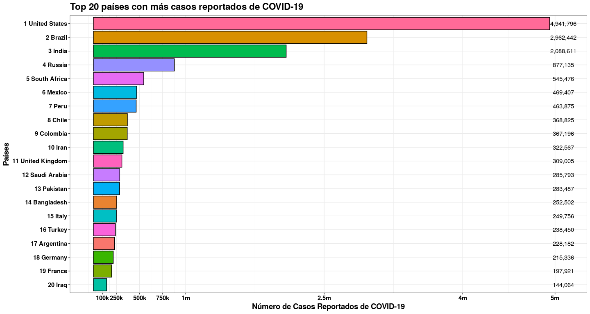<!-- -->

### Ranking de países con total de casos confirmados de COVID-19 - Sólo América:
Obtenemos los rankings pero ahora para el continente americano. Filtramos los datos por la columna continent de "Nort America" y "South America".

```r
ranking.total_cases.america <- covid.total.df[covid.total.df$continent %in% 
                                                c("North America", "South America") ,]
ranking.total_cases.america <- ranking.total_cases.america[order(-ranking.total_cases.america$total_cases),]
ranking.total_cases.america$position <- 1:nrow(ranking.total_cases.america)
bottom20.total_cases.america <- tail(ranking.total_cases.america[, c("position", "location", "total_cases")],5)
top20.total_cases.america <- head(ranking.total_cases.america[, c("position", "location", "total_cases")],20)
rownames(bottom20.total_cases.america) <- c()
rownames(top20.total_cases.america) <- c()
mexrow <- which(ranking.total_cases.america$location=='Mexico')
rm(ranking.total_cases.america)
top20.total_cases.america$total_cases_formated <- formatC(top20.total_cases.america$total_cases,
                                                          format="f", big.mark=",", digits=0)
bottom20.total_cases.america$total_cases_formated <- formatC(bottom20.total_cases.america$total_cases, 
                                                             format="f", big.mark=",", digits=0)
tablecolnames <- c("Posición", "País", "Casos Totales")
kable(top20.total_cases.america[,c(1,2,4)], format = "html", align = "clr", 
      col.names=tablecolnames, caption="Top 20 América - Países con más casos") %>%
  kable_styling(bootstrap_options = c("striped", "hover", "condensed", "responsive"), 
                full_width = F, position = "center") %>%
row_spec(mexrow, bold = T, color = "black", background = "yellow")
```

<table class="table table-striped table-hover table-condensed table-responsive" style="width: auto !important; margin-left: auto; margin-right: auto;">
<caption>Top 20 América - Países con más casos</caption>
 <thead>
  <tr>
   <th style="text-align:center;"> Posición </th>
   <th style="text-align:left;"> País </th>
   <th style="text-align:right;"> Casos Totales </th>
  </tr>
 </thead>
<tbody>
  <tr>
   <td style="text-align:center;"> 1 </td>
   <td style="text-align:left;"> United States </td>
   <td style="text-align:right;"> 4,941,796 </td>
  </tr>
  <tr>
   <td style="text-align:center;"> 2 </td>
   <td style="text-align:left;"> Brazil </td>
   <td style="text-align:right;"> 2,962,442 </td>
  </tr>
  <tr>
   <td style="text-align:center;font-weight: bold;color: black !important;background-color: yellow !important;"> 3 </td>
   <td style="text-align:left;font-weight: bold;color: black !important;background-color: yellow !important;"> Mexico </td>
   <td style="text-align:right;font-weight: bold;color: black !important;background-color: yellow !important;"> 469,407 </td>
  </tr>
  <tr>
   <td style="text-align:center;"> 4 </td>
   <td style="text-align:left;"> Peru </td>
   <td style="text-align:right;"> 463,875 </td>
  </tr>
  <tr>
   <td style="text-align:center;"> 5 </td>
   <td style="text-align:left;"> Chile </td>
   <td style="text-align:right;"> 368,825 </td>
  </tr>
  <tr>
   <td style="text-align:center;"> 6 </td>
   <td style="text-align:left;"> Colombia </td>
   <td style="text-align:right;"> 367,196 </td>
  </tr>
  <tr>
   <td style="text-align:center;"> 7 </td>
   <td style="text-align:left;"> Argentina </td>
   <td style="text-align:right;"> 228,182 </td>
  </tr>
  <tr>
   <td style="text-align:center;"> 8 </td>
   <td style="text-align:left;"> Canada </td>
   <td style="text-align:right;"> 118,970 </td>
  </tr>
  <tr>
   <td style="text-align:center;"> 9 </td>
   <td style="text-align:left;"> Ecuador </td>
   <td style="text-align:right;"> 91,969 </td>
  </tr>
  <tr>
   <td style="text-align:center;"> 10 </td>
   <td style="text-align:left;"> Bolivia </td>
   <td style="text-align:right;"> 87,891 </td>
  </tr>
  <tr>
   <td style="text-align:center;"> 11 </td>
   <td style="text-align:left;"> Dominican Republic </td>
   <td style="text-align:right;"> 77,709 </td>
  </tr>
  <tr>
   <td style="text-align:center;"> 12 </td>
   <td style="text-align:left;"> Panama </td>
   <td style="text-align:right;"> 72,560 </td>
  </tr>
  <tr>
   <td style="text-align:center;"> 13 </td>
   <td style="text-align:left;"> Guatemala </td>
   <td style="text-align:right;"> 55,270 </td>
  </tr>
  <tr>
   <td style="text-align:center;"> 14 </td>
   <td style="text-align:left;"> Honduras </td>
   <td style="text-align:right;"> 46,365 </td>
  </tr>
  <tr>
   <td style="text-align:center;"> 15 </td>
   <td style="text-align:left;"> Venezuela </td>
   <td style="text-align:right;"> 24,166 </td>
  </tr>
  <tr>
   <td style="text-align:center;"> 16 </td>
   <td style="text-align:left;"> Costa Rica </td>
   <td style="text-align:right;"> 22,081 </td>
  </tr>
  <tr>
   <td style="text-align:center;"> 17 </td>
   <td style="text-align:left;"> Puerto Rico </td>
   <td style="text-align:right;"> 20,686 </td>
  </tr>
  <tr>
   <td style="text-align:center;"> 18 </td>
   <td style="text-align:left;"> El Salvador </td>
   <td style="text-align:right;"> 19,544 </td>
  </tr>
  <tr>
   <td style="text-align:center;"> 19 </td>
   <td style="text-align:left;"> Haiti </td>
   <td style="text-align:right;"> 7,599 </td>
  </tr>
  <tr>
   <td style="text-align:center;"> 20 </td>
   <td style="text-align:left;"> Paraguay </td>
   <td style="text-align:right;"> 6,508 </td>
  </tr>
</tbody>
</table>
### Gráfica de barras horizontales con los 20 países con más casos reportados de COVID-19 de América.

```r
ggplot(data=top20.total_cases.america, aes(x=reorder(paste(position, location),total_cases),
                                           y=total_cases, fill=location))+
  geom_bar(stat = "identity", position=position_dodge(), colour="black", show.legend = FALSE)+
  ylab("Número de Casos Reportados de COVID-19") +
  geom_text(aes(y=max(total_cases)+150000, label=format(total_cases, big.mark=",")), color="black")+
  labs(title="Top 20 países con más casos reportados de COVID-19 de América")+
  scale_y_continuous(breaks=c(100000, 250000, 500000, 750000, 1000000, 2500000, 4000000, 5000000),
                     label=c("100k", "250k", "500k", "750k", "1m", "2.5m", "4m", "5m"))+
  coord_flip() +
  xlab("Países") +
  theme_bw()+
  theme(title = element_text(size=14, face="bold", colour = "black"),
        axis.text.y = element_text(size=11, face="bold", colour = "black"),
        axis.text.x = element_text(size=11, face="bold", colour = "black"))
```

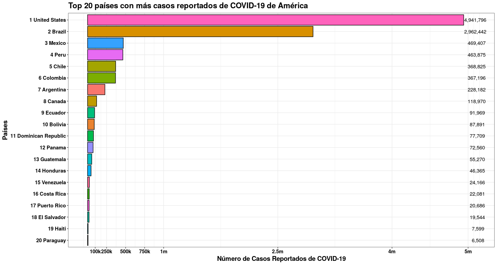<!-- -->

### Ranking de países con total de casos confirmados de COVID-19 por millón de habitantes
Para obtener el top 20 ordenamos los datos con la columna total_cases_per_million. Guardamos sólo los 20 países con más casos y los 20 países con menos casos. Finalmente, filtramos sólo las columnas que nos interesan. Y mostramos los datos en una tabla y en una gráfica de Barras horizontales. Cómo México no está en el top 20, lo agregamos al final con la posición correspondiente del ranking.
<div class = "row">

```r
ranking.total_cases_per_million <- covid.total.df[order(-covid.total.df$total_cases_per_million),]
ranking.total_cases_per_million$position <- 1:nrow(ranking.total_cases_per_million)
columnfilter <- c("position", "location", "total_cases_per_million")
mexico.total_cases_per_million <- ranking.total_cases_per_million[
                                  ranking.total_cases_per_million$location == "México", ]
bottom20.total_cases_per_million <- tail(ranking.total_cases_per_million[, columnfilter],20)
top20.total_cases_per_million <- head(ranking.total_cases_per_million[, columnfilter],20)
mexico.total_cases_per_million <- mexico.total_cases_per_million[, columnfilter]
rm(ranking.total_cases_per_million)
rownames(top20.total_cases_per_million) <- c()
rownames(bottom20.total_cases_per_million) <- c()
rownames(mexico.total_cases_per_million) <- c()


top20.total_cases_per_million <- rbind(top20.total_cases_per_million, mexico.total_cases_per_million)
mexrow <- which(top20.total_cases_per_million$location=='Mexico')
tablecolnames <- c("Posición", "País", "Casos")
top20.total_cases_per_million$total_cases_per_million_formated <- formatC(
  top20.total_cases_per_million$total_cases_per_million, format="f", big.mark=",", digits=2)
bottom20.total_cases_per_million$total_cases_per_million_formated<- formatC(
  bottom20.total_cases_per_million$total_cases_per_million, format="f", big.mark=",", digits=2)

kable(top20.total_cases_per_million[,c(1,2,4)], format = "html", align = "clr", 
      col.names=tablecolnames, caption="Top 20 - Países con más casos por millón de habitantes") %>% 
  kable_styling(bootstrap_options = c("striped", "hover", "condensed", "responsive"), 
                full_width = F, position = "float_left") %>%
  row_spec(mexrow, bold = T, color = "black", background = "yellow")

kable(bottom20.total_cases_per_million[,c(1,2,4)], format = "html", align = "clr", 
      col.names=tablecolnames, caption="Top 20 - Países con menos casos por millón de habitantes") %>% 
  kable_styling(bootstrap_options = c("striped", "hover", "condensed", "responsive"), 
                full_width = F, position = "right")
```

<table class="table table-striped table-hover table-condensed table-responsive" style="width: auto !important; float: left; margin-right: 10px;">
<caption>Top 20 - Países con más casos por millón de habitantes</caption>
 <thead>
  <tr>
   <th style="text-align:center;"> Posición </th>
   <th style="text-align:left;"> País </th>
   <th style="text-align:right;"> Casos </th>
  </tr>
 </thead>
<tbody>
  <tr>
   <td style="text-align:center;"> 1 </td>
   <td style="text-align:left;"> Qatar </td>
   <td style="text-align:right;"> 39,007.52 </td>
  </tr>
  <tr>
   <td style="text-align:center;"> 2 </td>
   <td style="text-align:left;"> Bahrain </td>
   <td style="text-align:right;"> 25,451.01 </td>
  </tr>
  <tr>
   <td style="text-align:center;"> 3 </td>
   <td style="text-align:left;"> Chile </td>
   <td style="text-align:right;"> 19,293.84 </td>
  </tr>
  <tr>
   <td style="text-align:center;"> 4 </td>
   <td style="text-align:left;"> Panama </td>
   <td style="text-align:right;"> 16,816.66 </td>
  </tr>
  <tr>
   <td style="text-align:center;"> 5 </td>
   <td style="text-align:left;"> Kuwait </td>
   <td style="text-align:right;"> 16,561.52 </td>
  </tr>
  <tr>
   <td style="text-align:center;"> 6 </td>
   <td style="text-align:left;"> Oman </td>
   <td style="text-align:right;"> 15,874.88 </td>
  </tr>
  <tr>
   <td style="text-align:center;"> 7 </td>
   <td style="text-align:left;"> United States </td>
   <td style="text-align:right;"> 14,929.78 </td>
  </tr>
  <tr>
   <td style="text-align:center;"> 8 </td>
   <td style="text-align:left;"> Peru </td>
   <td style="text-align:right;"> 14,068.82 </td>
  </tr>
  <tr>
   <td style="text-align:center;"> 9 </td>
   <td style="text-align:left;"> Brazil </td>
   <td style="text-align:right;"> 13,937.01 </td>
  </tr>
  <tr>
   <td style="text-align:center;"> 10 </td>
   <td style="text-align:left;"> Armenia </td>
   <td style="text-align:right;"> 13,459.96 </td>
  </tr>
  <tr>
   <td style="text-align:center;"> 11 </td>
   <td style="text-align:left;"> Singapore </td>
   <td style="text-align:right;"> 9,366.46 </td>
  </tr>
  <tr>
   <td style="text-align:center;"> 12 </td>
   <td style="text-align:left;"> Israel </td>
   <td style="text-align:right;"> 9,357.13 </td>
  </tr>
  <tr>
   <td style="text-align:center;"> 13 </td>
   <td style="text-align:left;"> South Africa </td>
   <td style="text-align:right;"> 9,197.24 </td>
  </tr>
  <tr>
   <td style="text-align:center;"> 14 </td>
   <td style="text-align:left;"> Saudi Arabia </td>
   <td style="text-align:right;"> 8,209.17 </td>
  </tr>
  <tr>
   <td style="text-align:center;"> 15 </td>
   <td style="text-align:left;"> Sweden </td>
   <td style="text-align:right;"> 8,151.38 </td>
  </tr>
  <tr>
   <td style="text-align:center;"> 16 </td>
   <td style="text-align:left;"> Bolivia </td>
   <td style="text-align:right;"> 7,529.41 </td>
  </tr>
  <tr>
   <td style="text-align:center;"> 17 </td>
   <td style="text-align:left;"> Belarus </td>
   <td style="text-align:right;"> 7,261.26 </td>
  </tr>
  <tr>
   <td style="text-align:center;"> 18 </td>
   <td style="text-align:left;"> Puerto Rico </td>
   <td style="text-align:right;"> 7,230.74 </td>
  </tr>
  <tr>
   <td style="text-align:center;"> 19 </td>
   <td style="text-align:left;"> Colombia </td>
   <td style="text-align:right;"> 7,216.49 </td>
  </tr>
  <tr>
   <td style="text-align:center;"> 20 </td>
   <td style="text-align:left;"> Dominican Republic </td>
   <td style="text-align:right;"> 7,163.50 </td>
  </tr>
</tbody>
</table>

<table class="table table-striped table-hover table-condensed table-responsive" style="width: auto !important; margin-right: 0; margin-left: auto">
<caption>Top 20 - Países con menos casos por millón de habitantes</caption>
 <thead>
  <tr>
   <th style="text-align:center;"> Posición </th>
   <th style="text-align:left;"> País </th>
   <th style="text-align:right;"> Casos </th>
  </tr>
 </thead>
<tbody>
  <tr>
   <td style="text-align:center;"> 137 </td>
   <td style="text-align:left;"> Eritrea </td>
   <td style="text-align:right;"> 80.36 </td>
  </tr>
  <tr>
   <td style="text-align:center;"> 138 </td>
   <td style="text-align:left;"> Mozambique </td>
   <td style="text-align:right;"> 70.80 </td>
  </tr>
  <tr>
   <td style="text-align:center;"> 139 </td>
   <td style="text-align:left;"> China </td>
   <td style="text-align:right;"> 61.54 </td>
  </tr>
  <tr>
   <td style="text-align:center;"> 140 </td>
   <td style="text-align:left;"> Syria </td>
   <td style="text-align:right;"> 60.57 </td>
  </tr>
  <tr>
   <td style="text-align:center;"> 141 </td>
   <td style="text-align:left;"> Yemen </td>
   <td style="text-align:right;"> 60.22 </td>
  </tr>
  <tr>
   <td style="text-align:center;"> 142 </td>
   <td style="text-align:left;"> Chad </td>
   <td style="text-align:right;"> 57.35 </td>
  </tr>
  <tr>
   <td style="text-align:center;"> 143 </td>
   <td style="text-align:left;"> Burkina Faso </td>
   <td style="text-align:right;"> 56.21 </td>
  </tr>
  <tr>
   <td style="text-align:center;"> 144 </td>
   <td style="text-align:left;"> Thailand </td>
   <td style="text-align:right;"> 47.97 </td>
  </tr>
  <tr>
   <td style="text-align:center;"> 145 </td>
   <td style="text-align:left;"> Niger </td>
   <td style="text-align:right;"> 47.63 </td>
  </tr>
  <tr>
   <td style="text-align:center;"> 146 </td>
   <td style="text-align:left;"> Angola </td>
   <td style="text-align:right;"> 45.12 </td>
  </tr>
  <tr>
   <td style="text-align:center;"> 147 </td>
   <td style="text-align:left;"> Burundi </td>
   <td style="text-align:right;"> 34.06 </td>
  </tr>
  <tr>
   <td style="text-align:center;"> 148 </td>
   <td style="text-align:left;"> Uganda </td>
   <td style="text-align:right;"> 27.41 </td>
  </tr>
  <tr>
   <td style="text-align:center;"> 149 </td>
   <td style="text-align:left;"> Papua New Guinea </td>
   <td style="text-align:right;"> 21.01 </td>
  </tr>
  <tr>
   <td style="text-align:center;"> 150 </td>
   <td style="text-align:left;"> Taiwan </td>
   <td style="text-align:right;"> 20.11 </td>
  </tr>
  <tr>
   <td style="text-align:center;"> 151 </td>
   <td style="text-align:left;"> Timor </td>
   <td style="text-align:right;"> 18.96 </td>
  </tr>
  <tr>
   <td style="text-align:center;"> 152 </td>
   <td style="text-align:left;"> Cambodia </td>
   <td style="text-align:right;"> 14.71 </td>
  </tr>
  <tr>
   <td style="text-align:center;"> 153 </td>
   <td style="text-align:left;"> Tanzania </td>
   <td style="text-align:right;"> 8.52 </td>
  </tr>
  <tr>
   <td style="text-align:center;"> 154 </td>
   <td style="text-align:left;"> Vietnam </td>
   <td style="text-align:right;"> 8.11 </td>
  </tr>
  <tr>
   <td style="text-align:center;"> 155 </td>
   <td style="text-align:left;"> Myanmar </td>
   <td style="text-align:right;"> 6.60 </td>
  </tr>
  <tr>
   <td style="text-align:center;"> 156 </td>
   <td style="text-align:left;"> Laos </td>
   <td style="text-align:right;"> 2.75 </td>
  </tr>
</tbody>
</table>
</div>
### Gráfica de barras horizontales con los 20 países con más casos reportados de COVID-19 por millón de habitantes (+ México)

```r
ggplot(data=top20.total_cases_per_million, aes(x=reorder(paste(position, location),total_cases_per_million), 
                                   y=total_cases_per_million, fill=location))+
  geom_bar(stat = "identity", position=position_dodge(), colour="black", show.legend = FALSE)+
  ylab("Número de Casos Reportados de COVID-19") +
  geom_text(aes(y=max(total_cases_per_million)+1250, label=total_cases_per_million_formated), color="black")+
  labs(title="Top 20 países con más casos reportados de COVID-19 por millón de habitantes (+ México)")+
  coord_flip() +
  xlab("Países") +
  theme_bw()+
  theme(title = element_text(size=14, face="bold", colour = "black"),
        axis.text.y = element_text(size=11, face="bold", colour = "black"),
        axis.text.x = element_text(size=11, face="bold", colour = "black"))
```

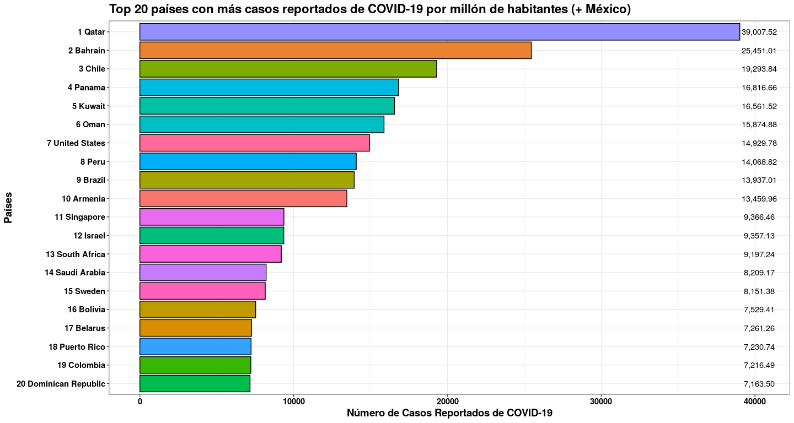<!-- -->

### Ranking de países con total de muertes atribuibles de COVID-19
Para obtener el top 20 ordenamos los datos con la columna total_deaths. Guardamos sólo los 20 países con más casos y los 20 países con menos casos. Filtramos sólo las columnas que nos interesan. Finalmente, mostramos los datos en una tabla y en una gráfica de Barras horizontales.


```r
ranking.total_deaths <- covid.total.df[order(-covid.total.df$total_deaths),]
ranking.total_deaths <- ranking.total_deaths[ranking.total_deaths$location != "World", ]
ranking.total_deaths$position <- 1:nrow(ranking.total_deaths)
columnfilter <- c("position", "location", "total_deaths")
bottom20.total_deaths <- tail(ranking.total_deaths[, columnfilter],20)
top20.total_deaths <- head(ranking.total_deaths[, columnfilter],20)
mexrow <- which(ranking.total_deaths$location=='Mexico')
rm(ranking.total_deaths)
rownames(top20.total_deaths) <- c()
rownames(bottom20.total_deaths) <- c()

tablecolnames <- c("Posición", "País", "Muertes")
top20.total_deaths$total_deaths_formated <- formatC(top20.total_deaths$total_deaths, 
                                                  format="f", big.mark=",", digits=0)
bottom20.total_deaths$total_deaths_formated <- formatC(bottom20.total_deaths$total_deaths, 
                                                     format="f", big.mark=",", digits=0)

kable(top20.total_deaths[,c(1,2,4)], format = "html", align = "clr", 
      col.names=tablecolnames, caption="Top 20 - Países con más muertes atribuibles a COVID-19") %>% 
  kable_styling(bootstrap_options = c("striped", "hover", "condensed", "responsive"), 
                full_width = F, position = "float_left") %>%
  row_spec(mexrow, bold = T, color = "black", background = "yellow")

kable(bottom20.total_deaths[,c(1,2,4)], format = "html", align = "clr", 
      col.names=tablecolnames, caption="Top 20 - Países con menos muertes atribuibles a COVID-19") %>% 
  kable_styling(bootstrap_options = c("striped", "hover", "condensed", "responsive"), 
                full_width = F, position = "right")
```

<table class="table table-striped table-hover table-condensed table-responsive" style="width: auto !important; float: left; margin-right: 10px;">
<caption>Top 20 - Países con más muertes atribuibles a COVID-19</caption>
 <thead>
  <tr>
   <th style="text-align:center;"> Posición </th>
   <th style="text-align:left;"> País </th>
   <th style="text-align:right;"> Muertes </th>
  </tr>
 </thead>
<tbody>
  <tr>
   <td style="text-align:center;"> 1 </td>
   <td style="text-align:left;"> United States </td>
   <td style="text-align:right;"> 161,356 </td>
  </tr>
  <tr>
   <td style="text-align:center;"> 2 </td>
   <td style="text-align:left;"> Brazil </td>
   <td style="text-align:right;"> 99,572 </td>
  </tr>
  <tr>
   <td style="text-align:center;font-weight: bold;color: black !important;background-color: yellow !important;"> 3 </td>
   <td style="text-align:left;font-weight: bold;color: black !important;background-color: yellow !important;"> Mexico </td>
   <td style="text-align:right;font-weight: bold;color: black !important;background-color: yellow !important;"> 51,311 </td>
  </tr>
  <tr>
   <td style="text-align:center;"> 4 </td>
   <td style="text-align:left;"> United Kingdom </td>
   <td style="text-align:right;"> 46,511 </td>
  </tr>
  <tr>
   <td style="text-align:center;"> 5 </td>
   <td style="text-align:left;"> India </td>
   <td style="text-align:right;"> 42,518 </td>
  </tr>
  <tr>
   <td style="text-align:center;"> 6 </td>
   <td style="text-align:left;"> Italy </td>
   <td style="text-align:right;"> 35,190 </td>
  </tr>
  <tr>
   <td style="text-align:center;"> 7 </td>
   <td style="text-align:left;"> France </td>
   <td style="text-align:right;"> 30,324 </td>
  </tr>
  <tr>
   <td style="text-align:center;"> 8 </td>
   <td style="text-align:left;"> Peru </td>
   <td style="text-align:right;"> 20,649 </td>
  </tr>
  <tr>
   <td style="text-align:center;"> 9 </td>
   <td style="text-align:left;"> Iran </td>
   <td style="text-align:right;"> 18,132 </td>
  </tr>
  <tr>
   <td style="text-align:center;"> 10 </td>
   <td style="text-align:left;"> Russia </td>
   <td style="text-align:right;"> 14,725 </td>
  </tr>
  <tr>
   <td style="text-align:center;"> 11 </td>
   <td style="text-align:left;"> Colombia </td>
   <td style="text-align:right;"> 12,250 </td>
  </tr>
  <tr>
   <td style="text-align:center;"> 12 </td>
   <td style="text-align:left;"> Chile </td>
   <td style="text-align:right;"> 9,958 </td>
  </tr>
  <tr>
   <td style="text-align:center;"> 13 </td>
   <td style="text-align:left;"> South Africa </td>
   <td style="text-align:right;"> 9,909 </td>
  </tr>
  <tr>
   <td style="text-align:center;"> 14 </td>
   <td style="text-align:left;"> Belgium </td>
   <td style="text-align:right;"> 9,866 </td>
  </tr>
  <tr>
   <td style="text-align:center;"> 15 </td>
   <td style="text-align:left;"> Germany </td>
   <td style="text-align:right;"> 9,195 </td>
  </tr>
  <tr>
   <td style="text-align:center;"> 16 </td>
   <td style="text-align:left;"> Canada </td>
   <td style="text-align:right;"> 8,970 </td>
  </tr>
  <tr>
   <td style="text-align:center;"> 17 </td>
   <td style="text-align:left;"> Netherlands </td>
   <td style="text-align:right;"> 6,154 </td>
  </tr>
  <tr>
   <td style="text-align:center;"> 18 </td>
   <td style="text-align:left;"> Pakistan </td>
   <td style="text-align:right;"> 6,068 </td>
  </tr>
  <tr>
   <td style="text-align:center;"> 19 </td>
   <td style="text-align:left;"> Ecuador </td>
   <td style="text-align:right;"> 5,897 </td>
  </tr>
  <tr>
   <td style="text-align:center;"> 20 </td>
   <td style="text-align:left;"> Turkey </td>
   <td style="text-align:right;"> 5,813 </td>
  </tr>
</tbody>
</table>

<table class="table table-striped table-hover table-condensed table-responsive" style="width: auto !important; margin-right: 0; margin-left: auto">
<caption>Top 20 - Países con menos muertes atribuibles a COVID-19</caption>
 <thead>
  <tr>
   <th style="text-align:center;"> Posición </th>
   <th style="text-align:left;"> País </th>
   <th style="text-align:right;"> Muertes </th>
  </tr>
 </thead>
<tbody>
  <tr>
   <td style="text-align:center;"> 136 </td>
   <td style="text-align:left;"> Namibia </td>
   <td style="text-align:right;"> 16 </td>
  </tr>
  <tr>
   <td style="text-align:center;"> 137 </td>
   <td style="text-align:left;"> Mozambique </td>
   <td style="text-align:right;"> 15 </td>
  </tr>
  <tr>
   <td style="text-align:center;"> 138 </td>
   <td style="text-align:left;"> Jamaica </td>
   <td style="text-align:right;"> 13 </td>
  </tr>
  <tr>
   <td style="text-align:center;"> 139 </td>
   <td style="text-align:left;"> Jordan </td>
   <td style="text-align:right;"> 11 </td>
  </tr>
  <tr>
   <td style="text-align:center;"> 140 </td>
   <td style="text-align:left;"> Sri Lanka </td>
   <td style="text-align:right;"> 11 </td>
  </tr>
  <tr>
   <td style="text-align:center;"> 141 </td>
   <td style="text-align:left;"> Mauritius </td>
   <td style="text-align:right;"> 10 </td>
  </tr>
  <tr>
   <td style="text-align:center;"> 142 </td>
   <td style="text-align:left;"> Vietnam </td>
   <td style="text-align:right;"> 10 </td>
  </tr>
  <tr>
   <td style="text-align:center;"> 143 </td>
   <td style="text-align:left;"> Trinidad and Tobago </td>
   <td style="text-align:right;"> 8 </td>
  </tr>
  <tr>
   <td style="text-align:center;"> 144 </td>
   <td style="text-align:left;"> Taiwan </td>
   <td style="text-align:right;"> 7 </td>
  </tr>
  <tr>
   <td style="text-align:center;"> 145 </td>
   <td style="text-align:left;"> Myanmar </td>
   <td style="text-align:right;"> 6 </td>
  </tr>
  <tr>
   <td style="text-align:center;"> 146 </td>
   <td style="text-align:left;"> Uganda </td>
   <td style="text-align:right;"> 6 </td>
  </tr>
  <tr>
   <td style="text-align:center;"> 147 </td>
   <td style="text-align:left;"> Rwanda </td>
   <td style="text-align:right;"> 5 </td>
  </tr>
  <tr>
   <td style="text-align:center;"> 148 </td>
   <td style="text-align:left;"> Papua New Guinea </td>
   <td style="text-align:right;"> 3 </td>
  </tr>
  <tr>
   <td style="text-align:center;"> 149 </td>
   <td style="text-align:left;"> Botswana </td>
   <td style="text-align:right;"> 2 </td>
  </tr>
  <tr>
   <td style="text-align:center;"> 150 </td>
   <td style="text-align:left;"> Burundi </td>
   <td style="text-align:right;"> 1 </td>
  </tr>
  <tr>
   <td style="text-align:center;"> 151 </td>
   <td style="text-align:left;"> Cambodia </td>
   <td style="text-align:right;"> 0 </td>
  </tr>
  <tr>
   <td style="text-align:center;"> 152 </td>
   <td style="text-align:left;"> Eritrea </td>
   <td style="text-align:right;"> 0 </td>
  </tr>
  <tr>
   <td style="text-align:center;"> 153 </td>
   <td style="text-align:left;"> Laos </td>
   <td style="text-align:right;"> 0 </td>
  </tr>
  <tr>
   <td style="text-align:center;"> 154 </td>
   <td style="text-align:left;"> Mongolia </td>
   <td style="text-align:right;"> 0 </td>
  </tr>
  <tr>
   <td style="text-align:center;"> 155 </td>
   <td style="text-align:left;"> Timor </td>
   <td style="text-align:right;"> 0 </td>
  </tr>
</tbody>
</table>
### Gráfica de barras horizontales con los 20 países con más muertes atribuibles a COVID-19.

```r
ggplot(data=top20.total_deaths, aes(x=reorder(paste(position, location),total_deaths), 
                                   y=total_deaths, fill=location))+
  geom_bar(stat = "identity", position=position_dodge(), colour="black", show.legend = FALSE)+
  ylab("Número de muertes atribuibles a COVID-19") +
  geom_text(aes(y=max(total_deaths)+7500, label=total_deaths_formated), color="black")+
  labs(title="Top 20 países con más muertes atribuibles a COVID-19")+
  scale_y_continuous(breaks=c(10000, 25000, 50000, 75000, 100000, 150000, 170000), 
                     label=c("10k", "25k", "50k", "75k", "100k", "150k", "170k"))+
  coord_flip() +
  xlab("Países") +
  theme_bw()+
  theme(title = element_text(size=14, face="bold", colour = "black"),
        axis.text.y = element_text(size=11, face="bold", colour = "black"),
        axis.text.x = element_text(size=11, face="bold", colour = "black"))
```

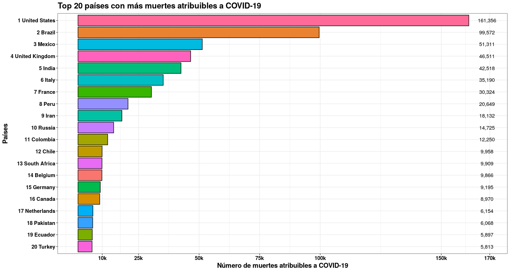<!-- -->

### Ranking de países con total de muertes atribuibles de COVID-19 por millón de habitantes
Para obtener el top 20 ordenamos los datos con la columna total_deaths_per_million. Guardamos sólo los 20 países con más casos y los 20 países con menos casos. Filtramos sólo las columnas que nos interesan. Finalmente, mostramos los datos en una tabla y en una gráfica de barras horizontales.


```r
ranking.total_deaths_per_million <- covid.total.df[order(-covid.total.df$total_deaths_per_million),]
ranking.total_deaths_per_million$position <- 1:nrow(ranking.total_deaths_per_million)
columnfilter <- c("position", "location", "total_deaths_per_million")
bottom20.total_deaths_per_million <- tail(ranking.total_deaths_per_million[, columnfilter],20)
top20.total_deaths_per_million <- head(ranking.total_deaths_per_million[, columnfilter],20)
mexrow <- which(ranking.total_deaths_per_million$location=='Mexico')
rm(ranking.total_deaths_per_million)
rownames(top20.total_deaths_per_million) <- c()
rownames(bottom20.total_deaths_per_million) <- c()

tablecolnames <- c("Posición", "País", "Muertes")
top20.total_deaths_per_million$total_deaths_per_million_formated <- formatC(
  top20.total_deaths_per_million$total_deaths_per_million, format="f", big.mark=",", digits=2)
bottom20.total_deaths_per_million$total_deaths_per_million_formated <- formatC(
  bottom20.total_deaths_per_million$total_deaths_per_million, format="f", big.mark=",", digits=2)

kable(top20.total_deaths_per_million[,c(1,2,4)], format = "html", align = "clr", 
      col.names=tablecolnames, 
      caption="Top 20 - Países con más muertes atribuibles a COVID-19 por millón de habitantes") %>% 
  kable_styling(bootstrap_options = c("striped", "hover", "condensed", "responsive"), 
                full_width = F, position = "float_left") %>%
  row_spec(mexrow, bold = T, color = "black", background = "yellow")

kable(bottom20.total_deaths_per_million[,c(1,2,4)], format = "html", align = "clr", 
      col.names=tablecolnames, 
      caption="Top 20 - Países con menos muertes atribuibles a COVID-19 por millón de habitantes") %>% 
  kable_styling(bootstrap_options = c("striped", "hover", "condensed", "responsive"), 
                full_width = F, position = "right")
```

<table class="table table-striped table-hover table-condensed table-responsive" style="width: auto !important; float: left; margin-right: 10px;">
<caption>Top 20 - Países con más muertes atribuibles a COVID-19 por millón de habitantes</caption>
 <thead>
  <tr>
   <th style="text-align:center;"> Posición </th>
   <th style="text-align:left;"> País </th>
   <th style="text-align:right;"> Muertes </th>
  </tr>
 </thead>
<tbody>
  <tr>
   <td style="text-align:center;"> 1 </td>
   <td style="text-align:left;"> Belgium </td>
   <td style="text-align:right;"> 851.28 </td>
  </tr>
  <tr>
   <td style="text-align:center;"> 2 </td>
   <td style="text-align:left;"> United Kingdom </td>
   <td style="text-align:right;"> 685.13 </td>
  </tr>
  <tr>
   <td style="text-align:center;"> 3 </td>
   <td style="text-align:left;"> Peru </td>
   <td style="text-align:right;"> 626.26 </td>
  </tr>
  <tr>
   <td style="text-align:center;"> 4 </td>
   <td style="text-align:left;"> Italy </td>
   <td style="text-align:right;"> 582.02 </td>
  </tr>
  <tr>
   <td style="text-align:center;"> 5 </td>
   <td style="text-align:left;"> Sweden </td>
   <td style="text-align:right;"> 570.63 </td>
  </tr>
  <tr>
   <td style="text-align:center;"> 6 </td>
   <td style="text-align:left;"> Chile </td>
   <td style="text-align:right;"> 520.92 </td>
  </tr>
  <tr>
   <td style="text-align:center;"> 7 </td>
   <td style="text-align:left;"> United States </td>
   <td style="text-align:right;"> 487.48 </td>
  </tr>
  <tr>
   <td style="text-align:center;"> 8 </td>
   <td style="text-align:left;"> Brazil </td>
   <td style="text-align:right;"> 468.44 </td>
  </tr>
  <tr>
   <td style="text-align:center;"> 9 </td>
   <td style="text-align:left;"> France </td>
   <td style="text-align:right;"> 464.57 </td>
  </tr>
  <tr>
   <td style="text-align:center;font-weight: bold;color: black !important;background-color: yellow !important;"> 10 </td>
   <td style="text-align:left;font-weight: bold;color: black !important;background-color: yellow !important;"> Mexico </td>
   <td style="text-align:right;font-weight: bold;color: black !important;background-color: yellow !important;"> 397.97 </td>
  </tr>
  <tr>
   <td style="text-align:center;"> 11 </td>
   <td style="text-align:left;"> Panama </td>
   <td style="text-align:right;"> 368.73 </td>
  </tr>
  <tr>
   <td style="text-align:center;"> 12 </td>
   <td style="text-align:left;"> Netherlands </td>
   <td style="text-align:right;"> 359.15 </td>
  </tr>
  <tr>
   <td style="text-align:center;"> 13 </td>
   <td style="text-align:left;"> Ireland </td>
   <td style="text-align:right;"> 358.87 </td>
  </tr>
  <tr>
   <td style="text-align:center;"> 14 </td>
   <td style="text-align:left;"> Ecuador </td>
   <td style="text-align:right;"> 334.24 </td>
  </tr>
  <tr>
   <td style="text-align:center;"> 15 </td>
   <td style="text-align:left;"> Bolivia </td>
   <td style="text-align:right;"> 301.89 </td>
  </tr>
  <tr>
   <td style="text-align:center;"> 16 </td>
   <td style="text-align:left;"> Armenia </td>
   <td style="text-align:right;"> 262.21 </td>
  </tr>
  <tr>
   <td style="text-align:center;"> 17 </td>
   <td style="text-align:left;"> Macedonia </td>
   <td style="text-align:right;"> 249.11 </td>
  </tr>
  <tr>
   <td style="text-align:center;"> 18 </td>
   <td style="text-align:left;"> Colombia </td>
   <td style="text-align:right;"> 240.75 </td>
  </tr>
  <tr>
   <td style="text-align:center;"> 19 </td>
   <td style="text-align:left;"> Canada </td>
   <td style="text-align:right;"> 237.66 </td>
  </tr>
  <tr>
   <td style="text-align:center;"> 20 </td>
   <td style="text-align:left;"> Kyrgyzstan </td>
   <td style="text-align:right;"> 223.78 </td>
  </tr>
</tbody>
</table>

<table class="table table-striped table-hover table-condensed table-responsive" style="width: auto !important; margin-right: 0; margin-left: auto">
<caption>Top 20 - Países con menos muertes atribuibles a COVID-19 por millón de habitantes</caption>
 <thead>
  <tr>
   <th style="text-align:center;"> Posición </th>
   <th style="text-align:left;"> País </th>
   <th style="text-align:right;"> Muertes </th>
  </tr>
 </thead>
<tbody>
  <tr>
   <td style="text-align:center;"> 137 </td>
   <td style="text-align:left;"> Nepal </td>
   <td style="text-align:right;"> 2.40 </td>
  </tr>
  <tr>
   <td style="text-align:center;"> 138 </td>
   <td style="text-align:left;"> Angola </td>
   <td style="text-align:right;"> 1.95 </td>
  </tr>
  <tr>
   <td style="text-align:center;"> 139 </td>
   <td style="text-align:left;"> Jordan </td>
   <td style="text-align:right;"> 1.08 </td>
  </tr>
  <tr>
   <td style="text-align:center;"> 140 </td>
   <td style="text-align:left;"> Botswana </td>
   <td style="text-align:right;"> 0.85 </td>
  </tr>
  <tr>
   <td style="text-align:center;"> 141 </td>
   <td style="text-align:left;"> Thailand </td>
   <td style="text-align:right;"> 0.83 </td>
  </tr>
  <tr>
   <td style="text-align:center;"> 142 </td>
   <td style="text-align:left;"> Sri Lanka </td>
   <td style="text-align:right;"> 0.51 </td>
  </tr>
  <tr>
   <td style="text-align:center;"> 143 </td>
   <td style="text-align:left;"> Mozambique </td>
   <td style="text-align:right;"> 0.48 </td>
  </tr>
  <tr>
   <td style="text-align:center;"> 144 </td>
   <td style="text-align:left;"> Rwanda </td>
   <td style="text-align:right;"> 0.39 </td>
  </tr>
  <tr>
   <td style="text-align:center;"> 145 </td>
   <td style="text-align:left;"> Tanzania </td>
   <td style="text-align:right;"> 0.35 </td>
  </tr>
  <tr>
   <td style="text-align:center;"> 146 </td>
   <td style="text-align:left;"> Papua New Guinea </td>
   <td style="text-align:right;"> 0.34 </td>
  </tr>
  <tr>
   <td style="text-align:center;"> 147 </td>
   <td style="text-align:left;"> Taiwan </td>
   <td style="text-align:right;"> 0.29 </td>
  </tr>
  <tr>
   <td style="text-align:center;"> 148 </td>
   <td style="text-align:left;"> Uganda </td>
   <td style="text-align:right;"> 0.13 </td>
  </tr>
  <tr>
   <td style="text-align:center;"> 149 </td>
   <td style="text-align:left;"> Myanmar </td>
   <td style="text-align:right;"> 0.11 </td>
  </tr>
  <tr>
   <td style="text-align:center;"> 150 </td>
   <td style="text-align:left;"> Vietnam </td>
   <td style="text-align:right;"> 0.10 </td>
  </tr>
  <tr>
   <td style="text-align:center;"> 151 </td>
   <td style="text-align:left;"> Burundi </td>
   <td style="text-align:right;"> 0.08 </td>
  </tr>
  <tr>
   <td style="text-align:center;"> 152 </td>
   <td style="text-align:left;"> Cambodia </td>
   <td style="text-align:right;"> 0.00 </td>
  </tr>
  <tr>
   <td style="text-align:center;"> 153 </td>
   <td style="text-align:left;"> Eritrea </td>
   <td style="text-align:right;"> 0.00 </td>
  </tr>
  <tr>
   <td style="text-align:center;"> 154 </td>
   <td style="text-align:left;"> Laos </td>
   <td style="text-align:right;"> 0.00 </td>
  </tr>
  <tr>
   <td style="text-align:center;"> 155 </td>
   <td style="text-align:left;"> Mongolia </td>
   <td style="text-align:right;"> 0.00 </td>
  </tr>
  <tr>
   <td style="text-align:center;"> 156 </td>
   <td style="text-align:left;"> Timor </td>
   <td style="text-align:right;"> 0.00 </td>
  </tr>
</tbody>
</table>
### Gráfica de barras horizontales con los 20 países con más muertes atribuibles a COVID-19 por millón de habitantes.

```r
ggplot(data=top20.total_deaths_per_million, aes(x=reorder(paste(position, location),total_deaths_per_million), 
                                   y=total_deaths_per_million, fill=location))+
  geom_bar(stat = "identity", position=position_dodge(), colour="black", show.legend = FALSE)+
  ylab("Número de muertes atribuibles a COVID-19 por millón de habitantes") +
  geom_text(aes(y=max(total_deaths_per_million)+25, label=total_deaths_per_million_formated), color="black")+
  labs(title="Top 20 países con más muertes atribuibles a COVID-19 por millón de habitantes")+
  coord_flip() +
  xlab("Países") +
  theme_bw()+
  theme(title = element_text(size=14, face="bold", colour = "black"),
        axis.text.y = element_text(size=11, face="bold", colour = "black"),
        axis.text.x = element_text(size=11, face="bold", colour = "black"))
```

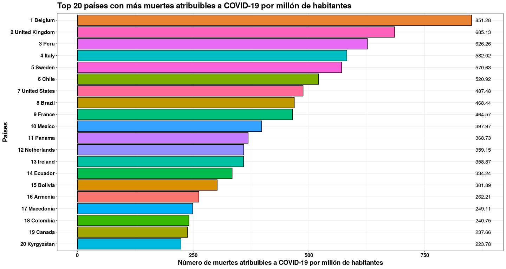<!-- -->

## Tendencias

### Tendencias de nuevos contagios de los 5 países con más casos reportados de COVID-19 + México
Gráfica creada desde la fecha inicial del conjunto de datos:

```r
plot.trend.new_cases <- function(startdate, enddate, countries, graphtitle){
  tmp.df <- covid.df[covid.df$location %in% countries,]
  tmp.df <- tmp.df[tmp.df$date >= startdate,]
  tmp.df <- tmp.df[tmp.df$date <= enddate,]
  ggplot(data=tmp.df , aes(x=date, y=new_cases, group=location, colour=location)) +
    geom_line(size=1) +
    scale_color_discrete(name = "Países")+
    scale_x_date(date_breaks = "month", date_labels = "%B")+
    ggtitle(graphtitle)+
    ylab("Nuevos casos de COVID-19")+
    xlab("Fecha")+
    theme_bw()+
    theme(title = element_text(size=14, face="bold", colour = "black"),
          axis.text.y = element_text(size=11, face="bold", colour = "black"), 
          axis.text.x = element_text(size=11, face="bold", colour = "black"),
          legend.position = "bottom",
          legend.title = element_text(size = 14),
          legend.text = element_text(size = 13),
          legend.key.width = unit(1.5,"cm"))+
    guides(colour = guide_legend(override.aes = list(size=2)))
}
top5.total_cases <- c(head(as.character(top20.total_cases$location),5), "México")
plot.trend.new_cases(startdate, enddate, top5.total_cases, "Tendencia de contagios de Covid-19 por países de enero a agosto")
```

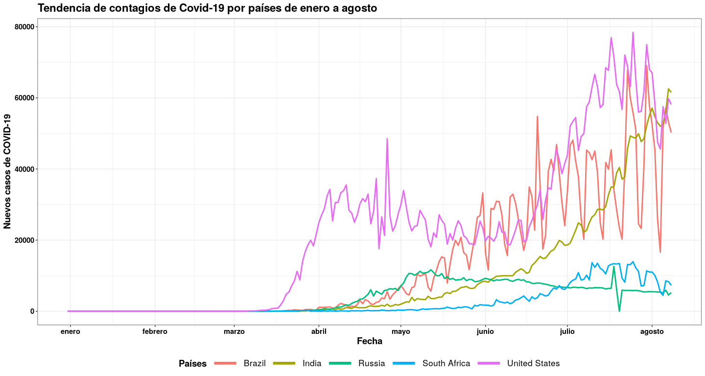<!-- -->
Podemos observar que las líneas empiezan a subir a partir de marzo. Modificamos la gráfica con diversas fechas de inicio. Por ejemplo, con los datos a partir de marzo:

```r
plot.trend.new_cases("2020-03-01", enddate, top5.total_cases, "Tendencia de contagios de Covid-19 por países de marzo a agosto")
```

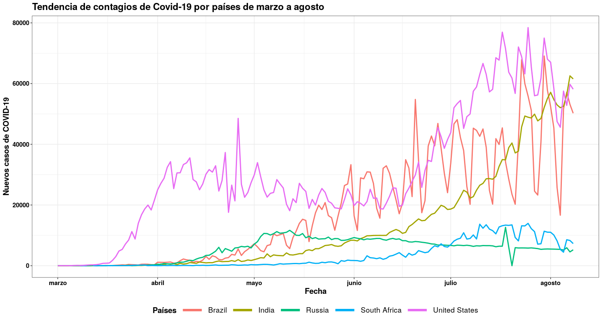<!-- -->


```r
plot.trend.new_cases("2020-06-01", enddate, top5.total_cases, "Tendencia de contagios de Covid-19 por países de junio a agosto")
```

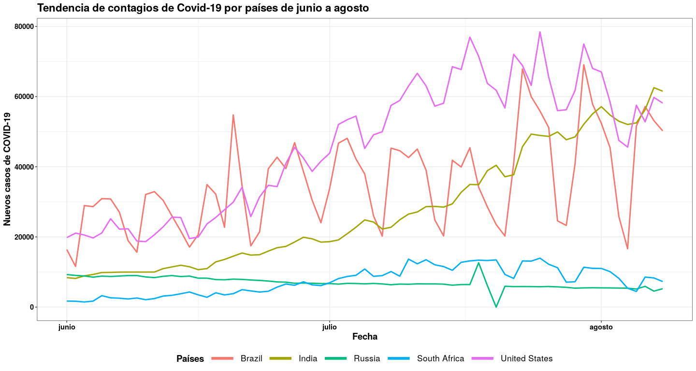<!-- -->


```r
plot.trend.new_cases("2020-07-01", enddate, top5.total_cases, "Tendencia de contagios de Covid-19 por países de julio a agosto")
```

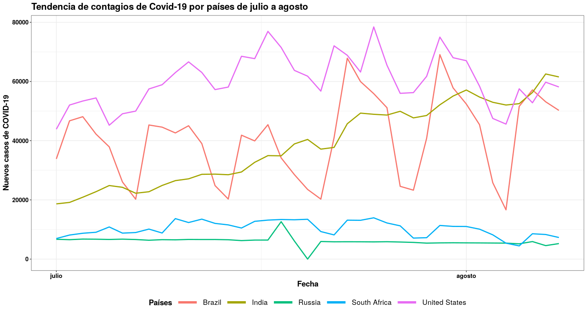<!-- -->


```r
plot.trend.new_cases <- function(startdate, enddate, countries, graphtitle){
  tmp.df <- covid.df[covid.df$location %in% countries,]
  tmp.df <- tmp.df[tmp.df$date >= startdate,]
  tmp.df <- tmp.df[tmp.df$date <= enddate,]
  ggplot(data=tmp.df , aes(x=date, y=new_cases, group=location, colour=location)) +
    geom_line(size=1) +
    scale_color_discrete(name = "Países")+
    scale_x_date(date_breaks = "day", date_labels = "%b %d")+
    ggtitle(graphtitle)+
    ylab("Nuevos casos de COVID-19")+
    xlab("Fecha")+
    theme_bw()+
    theme(title = element_text(size=14, face="bold", colour = "black"),
          axis.text.y = element_text(size=11, face="bold", colour = "black"), 
          axis.text.x = element_text(size=11, face="bold", colour = "black"),
          legend.position = "bottom",
          legend.title = element_text(size = 14),
          legend.text = element_text(size = 13),
          legend.key.width = unit(1.5,"cm"))+
    guides(colour = guide_legend(override.aes = list(size=2)))
}
plot.trend.new_cases(enddate-14, enddate, top5.total_cases, "Tendencia de contagios de Covid-19 por países de las últimas dos semanas")
```

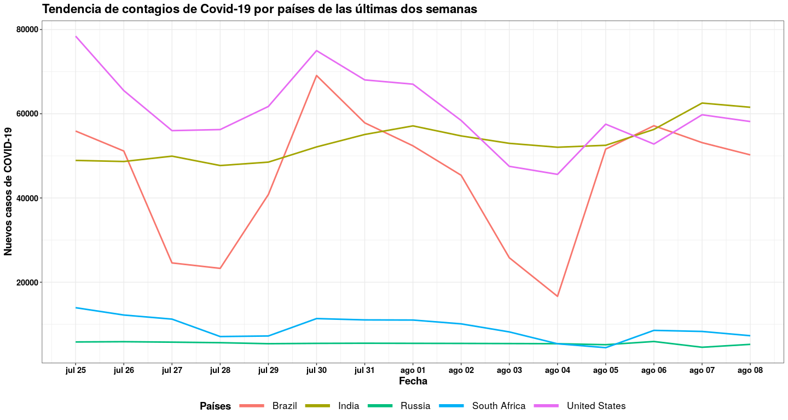<!-- -->

### Tendencias de nuevas muertes por covid de los 5 países con más casos reportados + México
Gráfica creada desde la fecha inicial del conjunto de datos:

```r
plot.trend.new_deaths <- function(startdate, enddate, countries, graphtitle){
  tmp.df <- covid.df[covid.df$location %in% countries,]
  tmp.df <- tmp.df[tmp.df$date >= startdate,]
  tmp.df <- tmp.df[tmp.df$date <= enddate,]
  ggplot(data=tmp.df , aes(x=date, y=new_deaths, group=location, colour=location)) +
    geom_line(size=1) +
    scale_color_discrete(name = "Países")+
    scale_x_date(date_breaks = "month", date_labels = "%B")+
    ggtitle(graphtitle)+
    ylab("Nuevos muertes atribuibles a COVID-19")+
    xlab("Fecha")+
    theme_bw()+
    theme(title = element_text(size=14, face="bold", colour = "black"),
          axis.text.y = element_text(size=11, face="bold", colour = "black"), 
          axis.text.x = element_text(size=11, face="bold", colour = "black"),
          legend.position = "bottom",
          legend.title = element_text(size = 14),
          legend.text = element_text(size = 13),
          legend.key.width = unit(1.5,"cm"))+
    guides(colour = guide_legend(override.aes = list(size=2)))
}
top5.total_cases <- c(head(as.character(top20.total_cases$location),5), "México")
plot.trend.new_deaths(startdate, enddate, top5.total_cases, "Tendencia de nuevas muertes atribuidas a Covid-19 por países de enero a agosto")
```

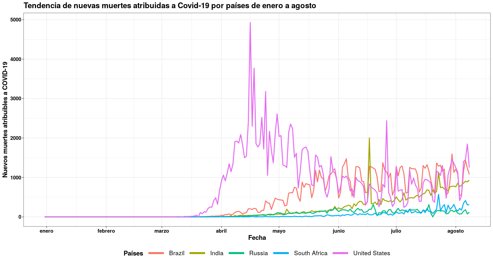<!-- -->
Gráfica con los datos a partir de marzo:

```r
plot.trend.new_deaths("2020-03-01", enddate, top5.total_cases, "Tendencia de nuevas muertes atribuidas a Covid-19 de marzo a agosto")
```

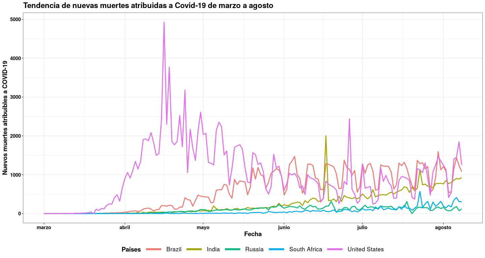<!-- -->


```r
plot.trend.new_deaths("2020-06-01", enddate, top5.total_cases, "Tendencia de nuevas muertes atribuidas a Covid-19 por países de junio a agosto")
```

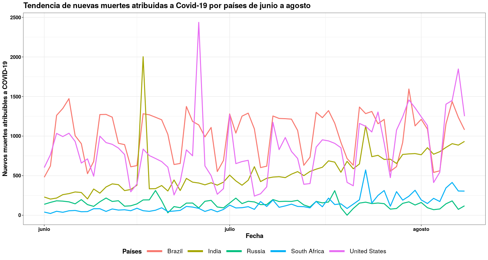<!-- -->


```r
plot.trend.new_deaths("2020-07-01", enddate, top5.total_cases, "Tendencia de nuevas muertes atribuidas a Covid-19 por países de julio a agosto")
```

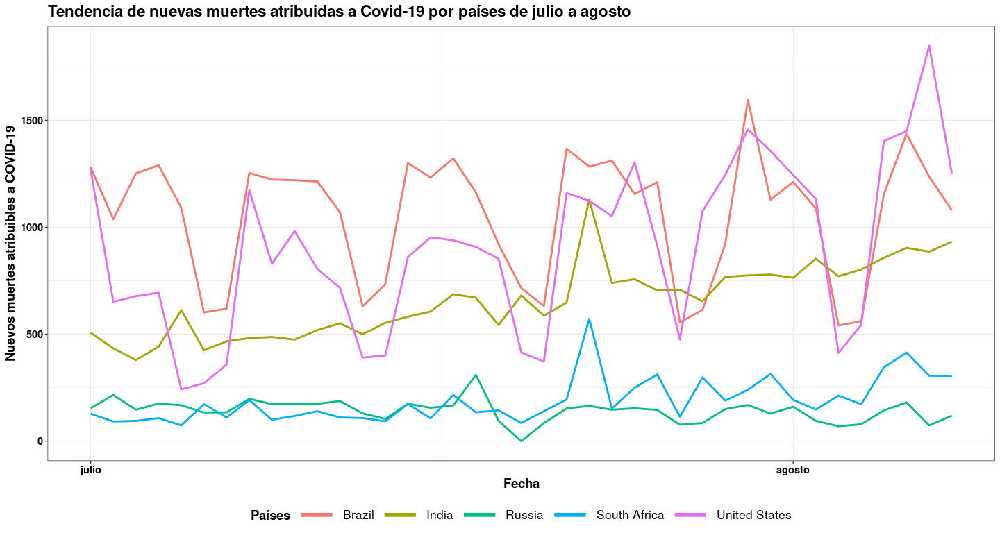<!-- -->


```r
plot.trend.new_deaths <- function(startdate, enddate, countries, graphtitle){
  tmp.df <- covid.df[covid.df$location %in% countries,]
  tmp.df <- tmp.df[tmp.df$date >= startdate,]
  tmp.df <- tmp.df[tmp.df$date <= enddate,]
  ggplot(data=tmp.df , aes(x=date, y=new_deaths, group=location, colour=location)) +
    geom_line(size=1) +
    scale_color_discrete(name = "Países")+
    scale_x_date(date_breaks = "day", date_labels = "%b %d")+
    ggtitle(graphtitle)+
    ylab("Nuevos casos de COVID-19")+
    xlab("Fecha")+
    theme_bw()+
    theme(title = element_text(size=14, face="bold", colour = "black"),
        axis.text.y = element_text(size=11, face="bold", colour = "black"),
        axis.text.x = element_text(size=11, face="bold", colour = "black"),
        legend.position = "bottom",
        legend.title = element_text(size = 14),
        legend.text = element_text(size = 13),
        legend.key.width = unit(1.5,"cm"))+
        guides(colour = guide_legend(override.aes = list(size=2)))
}
plot.trend.new_deaths(enddate-14, enddate, top5.total_cases, "Tendencia de nuevas muertes atribuidas a Covid-19 por países de las últimas dos semanas")
```

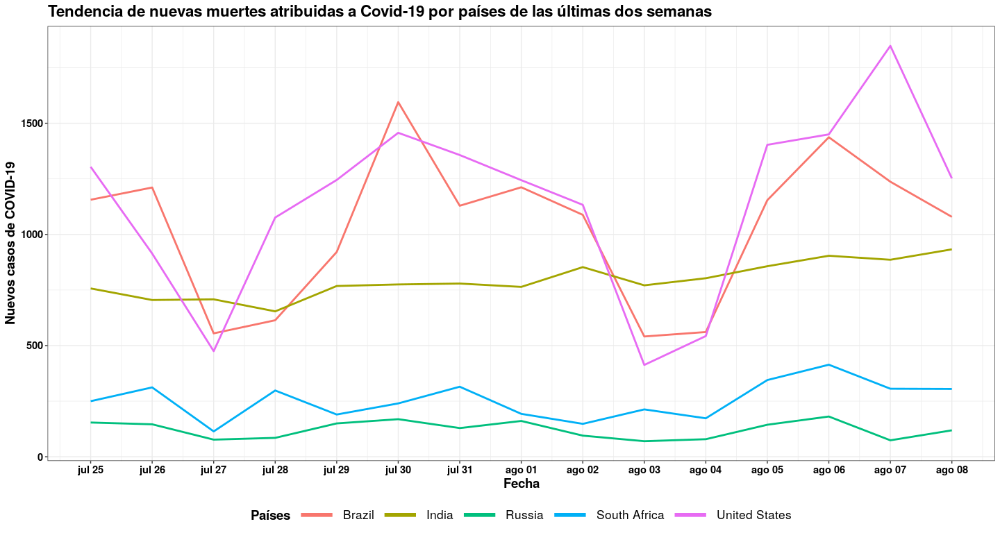<!-- -->

### Curvas de contagios acumulados de COVID-19 de los 5 países con más casos reportados + México

```r
plot.trend.total_cases <- function(startdate, enddate, countries, graphtitle){
  tmp.df <- covid.df[covid.df$location %in% countries,]
  tmp.df <- tmp.df[tmp.df$date >= startdate,]
  tmp.df <- tmp.df[tmp.df$date <= enddate,]
  ggplot(data=tmp.df , aes(x=date, y=total_cases, group=location, colour=location)) +
    geom_line(size=1) +
    scale_color_discrete(name = "Países")+
    scale_x_date(date_breaks = "month", date_labels = "%B")+
    ggtitle(graphtitle)+
    ylab("Casos acumulados de COVID-19")+
    xlab("Fecha")+
    theme_bw()+
    theme(title = element_text(size=14, face="bold", colour = "black"),
        axis.text.y = element_text(size=11, face="bold", colour = "black"),
        axis.text.x = element_text(size=11, face="bold", colour = "black"),
        legend.position = "bottom",
        legend.title = element_text(size = 14),
        legend.text = element_text(size = 13),
        legend.key.width = unit(1.5,"cm"))+
        guides(colour = guide_legend(override.aes = list(size=2)))
}
plot.trend.total_cases(startdate, enddate, top5.total_cases, "Curvas de contagios acumulados de COVID-19 de los 5 países con más contagios reportados ")
```

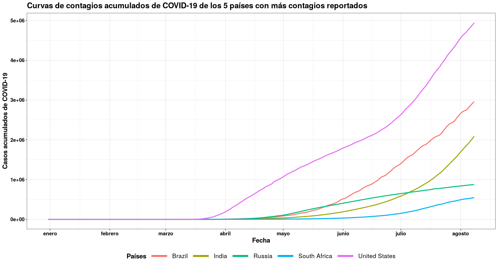<!-- -->


Gráfica con los datos a partir de marzo:

```r
plot.trend.total_cases("2020-03-01", enddate, top5.total_cases, "Curvas de contagios acumulados de COVID-19 de los 5 países con más contagios reportados de marzo a agosto")
```

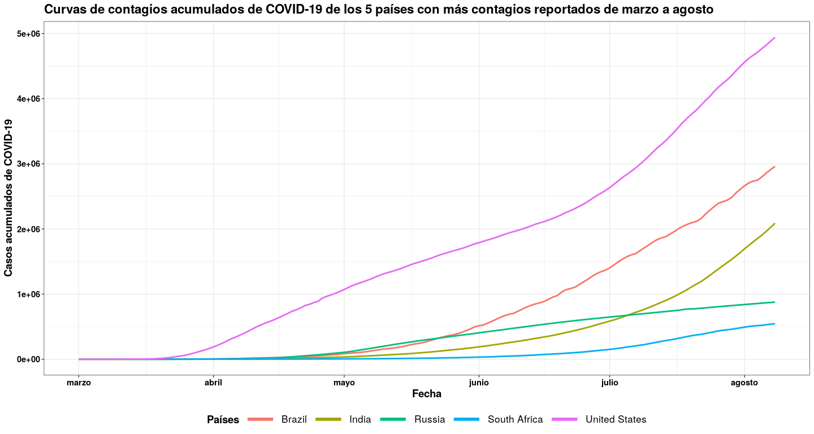<!-- -->


```r
plot.trend.total_cases("2020-06-01", enddate, top5.total_cases, "Curvas de contagios acumulados de COVID-19 de los 5 países con más contagios reportados de junio a agosto")
```

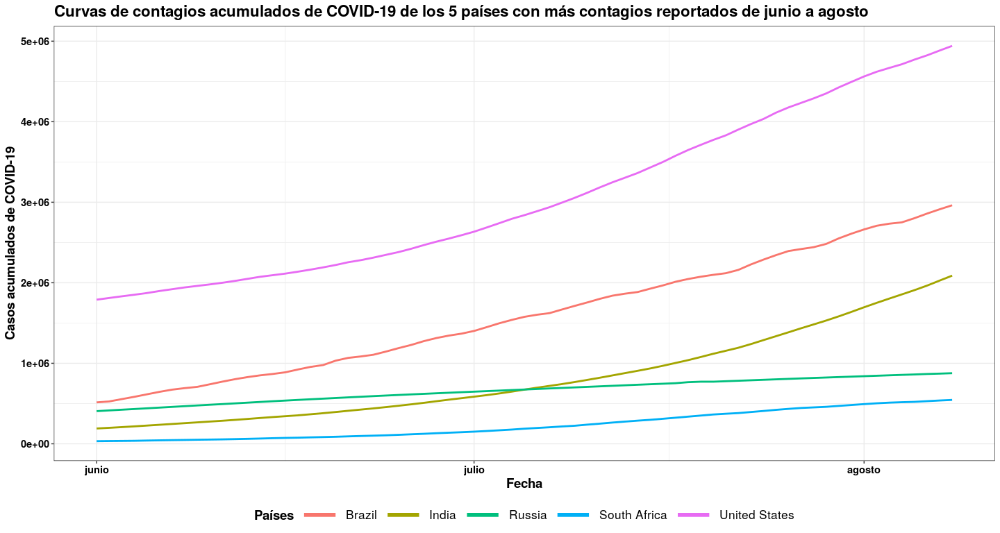<!-- -->


```r
plot.trend.total_cases("2020-07-01", enddate, top5.total_cases, "Curvas de contagios acumulados de COVID-19 de los 5 países con más contagios reportados de julio a agosto")
```

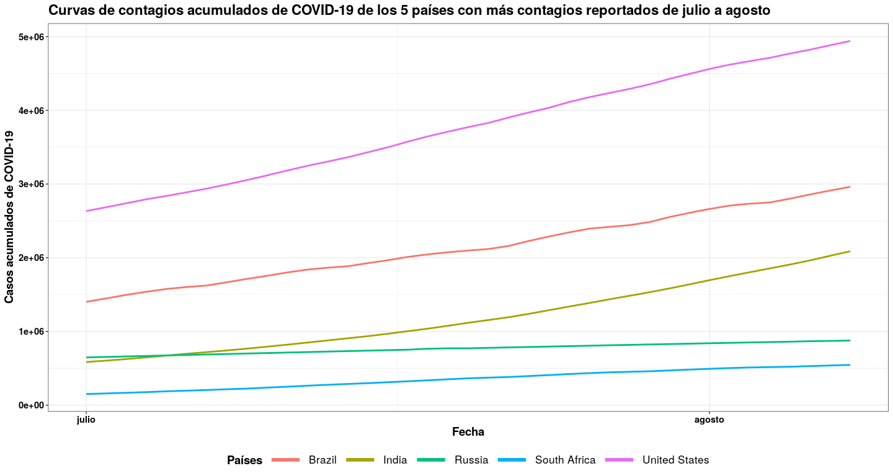<!-- -->

La cantidad de contagios que tienen Estados Unidos y Brasil no me permiten apreciar las curvas del resto de los países. Quitamos a esos 2 países y agregamos a los 2 países que sigan en el top 20 de países con más contagios reportados.

```r
total_cases.others <- as.character(top20.total_cases$location)[3:7]
plot.trend.total_cases("2020-07-01", enddate, total_cases.others, "Curvas de contagios acumulados de COVID-19 reportados de julio a agosto")
```

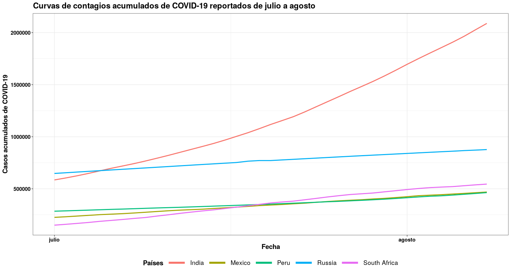<!-- -->


```r
plot.trend.total_cases <- function(startdate, enddate, countries, graphtitle){
  tmp.df <- covid.df[covid.df$location %in% countries,]
  tmp.df <- tmp.df[tmp.df$date >= startdate,]
  tmp.df <- tmp.df[tmp.df$date <= enddate,]
  ggplot(data=tmp.df , aes(x=date, y=total_cases, group=location, colour=location)) +
    geom_line(size=1) +
    scale_color_discrete(name = "Países")+
    scale_x_date(date_breaks = "day", date_labels = "%b %d")+
    ggtitle(graphtitle)+
    ylab("Casos acumulados de COVID-19")+
    xlab("Fecha")+
    theme_bw()+
    theme(title = element_text(size=14, face="bold", colour = "black"),
        axis.text.y = element_text(size=11, face="bold", colour = "black"),
        axis.text.x = element_text(size=11, face="bold", colour = "black"),
        legend.position = "bottom",
        legend.title = element_text(size = 14),
        legend.text = element_text(size = 13),
        legend.key.width = unit(1.5,"cm"))+
        guides(colour = guide_legend(override.aes = list(size=2)))
}
plot.trend.total_cases(enddate-14, enddate, total_cases.others, "Curvas de contagios acumulados de COVID-19 reportados las últimas dos semanas")
```

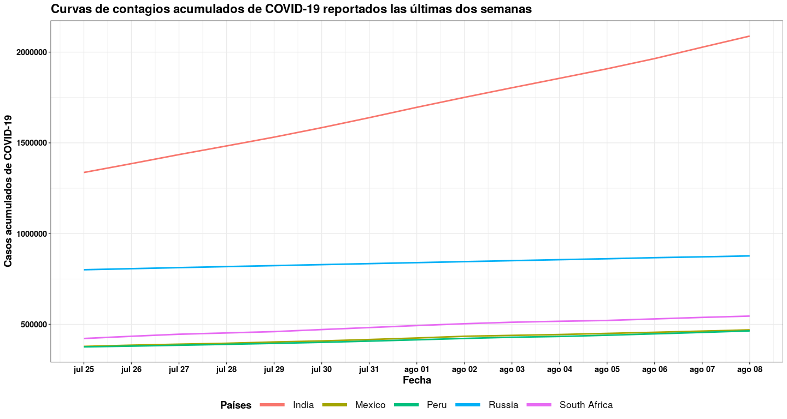<!-- -->

Quitamos a India y Rusia, para ver más a detalle las curvas de contagio acumulado de México, perú y Sudáfrica de las últimas dos semanas:

```r
total_cases.others <- as.character(top20.total_cases$location)[3:7]
total_cases.others <- total_cases.others[c(-1,-2)]
countrieslabels <- paste(total_cases.others, collapse = ', ')
plot.trend.total_cases(enddate-14, enddate, total_cases.others, paste("Curvas de contagios acumulados de COVID-19 reportados las últimas dos semanas",countrieslabels))
```

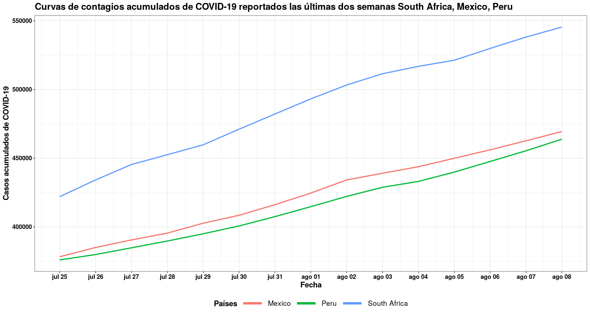<!-- -->

### Curvas de muertes acumuladas por COVID-19 de los 5 países con más muertes reportadas + México

```r
plot.trend.total_deaths <- function(startdate, enddate, countries, graphtitle){
  tmp.df <- covid.df[covid.df$location %in% countries,]
  tmp.df <- tmp.df[tmp.df$date >= startdate,]
  tmp.df <- tmp.df[tmp.df$date <= enddate,]
  ggplot(data=tmp.df , aes(x=date, y=total_deaths, group=location, colour=location)) +
    geom_line(size=1) +
    scale_color_discrete(name = "Países")+
    scale_x_date(date_breaks = "month", date_labels = "%B")+
    ggtitle(graphtitle)+
    ylab("Muertes acumulados por COVID-19")+
    xlab("Fecha")+
    theme_bw()+
    theme(title = element_text(size=14, face="bold", colour = "black"),
        axis.text.y = element_text(size=11, face="bold", colour = "black"),
        axis.text.x = element_text(size=11, face="bold", colour = "black"),
        legend.position = "bottom",
        legend.title = element_text(size = 14),
        legend.text = element_text(size = 13),
        legend.key.width = unit(1.5,"cm"))+
        guides(colour = guide_legend(override.aes = list(size=2)))
}
top5.total_deaths <-  head(as.character(top20.total_deaths$location),5)
plot.trend.total_deaths(startdate, enddate, top5.total_deaths, "Curvas de muertes acumuladas de COVID-19 de los 5 países con más muertes reportadas en total ")
```

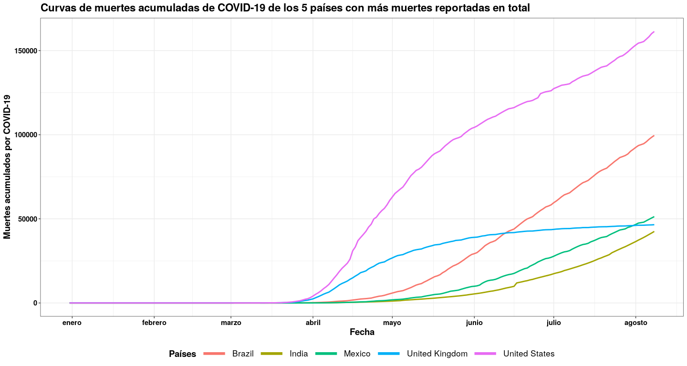<!-- -->


Gráfica con los datos a partir de marzo:

```r
plot.trend.total_deaths("2020-03-01", enddate, top5.total_deaths, "Curvas de muertes acumuladas por COVID-19 de marzo a agosto de los 5 países con más muertes reportadas en total")
```

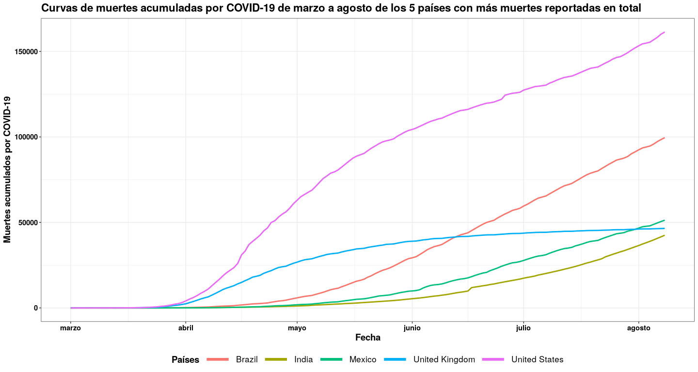<!-- -->


```r
plot.trend.total_deaths("2020-06-01", enddate, top5.total_deaths, "Curvas de muertes acumuladas por COVID-19 de junio a agosto de los 5 países con más muertes reportadas en total")
```

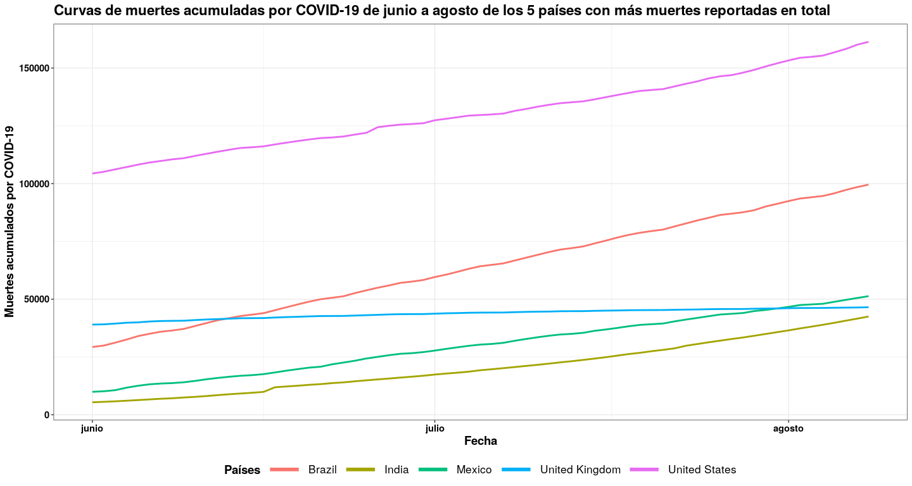<!-- -->


```r
plot.trend.total_deaths("2020-07-01", enddate, top5.total_deaths, "Curvas de muertes acumuladas por COVID-19 de julio a agosto de los 5 países con más muertes reportadas en total")
```

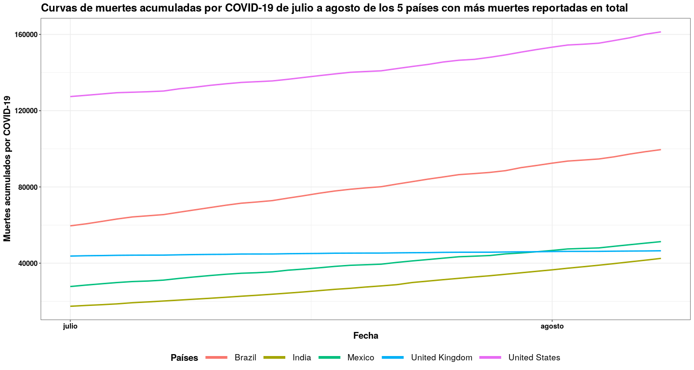<!-- -->

La cantidad de contagios que tienen Estados Unidos y Brasil no permiten apreciar las curvas del resto de los países. Quitamos a esos 2 países y agregamos a los 2 países que sigan en el top 20 de países con más contagios reportados.

```r
total_deaths.others <- as.character(top20.total_deaths$location)[3:7]
plot.trend.total_deaths("2020-07-01", enddate, total_deaths.others, "Curvas de contagios acumulados de COVID-19 reportados de julio a agosto")
```

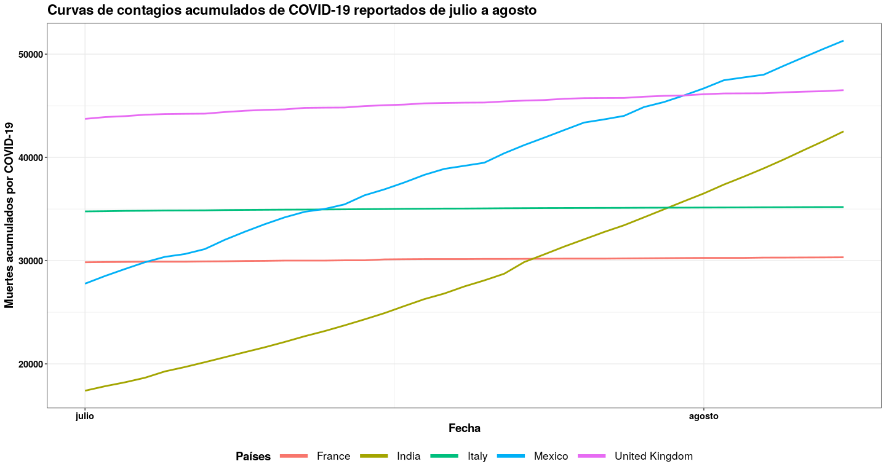<!-- -->


```r
plot.trend.total_deaths <- function(startdate, enddate, countries, graphtitle){
  tmp.df <- covid.df[covid.df$location %in% countries,]
  tmp.df <- tmp.df[tmp.df$date >= startdate,]
  tmp.df <- tmp.df[tmp.df$date <= enddate,]
  ggplot(data=tmp.df , aes(x=date, y=total_deaths, group=location, colour=location)) +
    geom_line(size=1) +
    scale_color_discrete(name = "Países")+
    scale_x_date(date_breaks = "day", date_labels = "%b %d")+
    ggtitle(graphtitle)+
    ylab("Muertes acumulados por COVID-19")+
    xlab("Fecha")+
    theme_bw()+
    theme(title = element_text(size=14, face="bold", colour = "black"),
        axis.text.y = element_text(size=11, face="bold", colour = "black"),
        axis.text.x = element_text(size=11, face="bold", colour = "black"),
        legend.position = "bottom",
        legend.title = element_text(size = 14),
        legend.text = element_text(size = 13),
        legend.key.width = unit(1.5,"cm"))+
        guides(colour = guide_legend(override.aes = list(size=2)))
}
plot.trend.total_deaths(enddate-14, enddate, total_deaths.others, "Curvas de contagios acumulados de COVID-19 reportados de las últimas dos semanas")
```

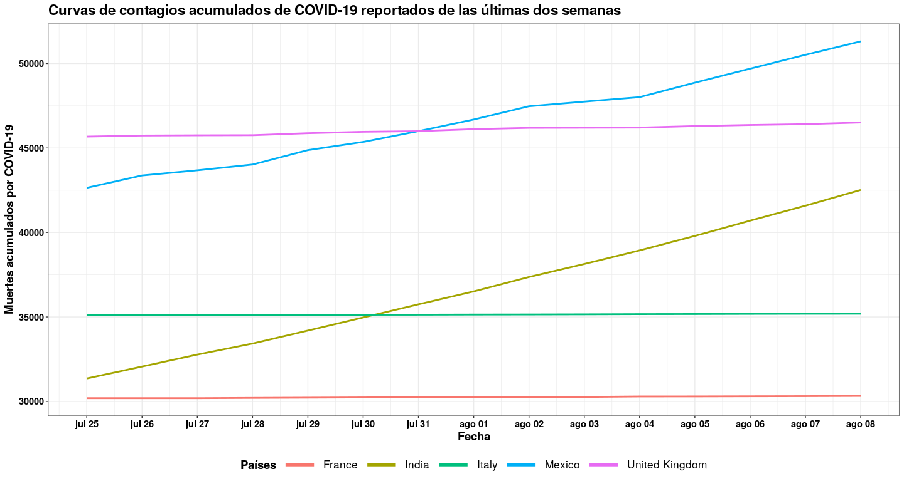<!-- -->

Las curvas de Francia, Italia y Reino Unido están planas, se ha estancado la cantidad de muertes atribuidas a COVID-19. Una posible razón es que la pandemia inició primero en Europa. Las curvas de México e India siguen en aumento. Quitamos esos países y agregamos otros en donde al parecer la cantidad de muertes atribuidas a COVID-19 aún sigue en aumento, y generamos la gráfica de las curvas de las últimas 2 semanas sin contar a Estados Unidos y Brasil:

```r
total_deaths.others <- as.character(top20.total_deaths$location)[c(3,5,8,9,10)]
countrieslabels <- paste(total_deaths.others, collapse = ', ')
plot.trend.total_deaths(enddate-14, enddate, total_deaths.others, paste("Curvas de muertes acumuladas por COVID-19 reportadas las últimas dos semanas:",countrieslabels))
```

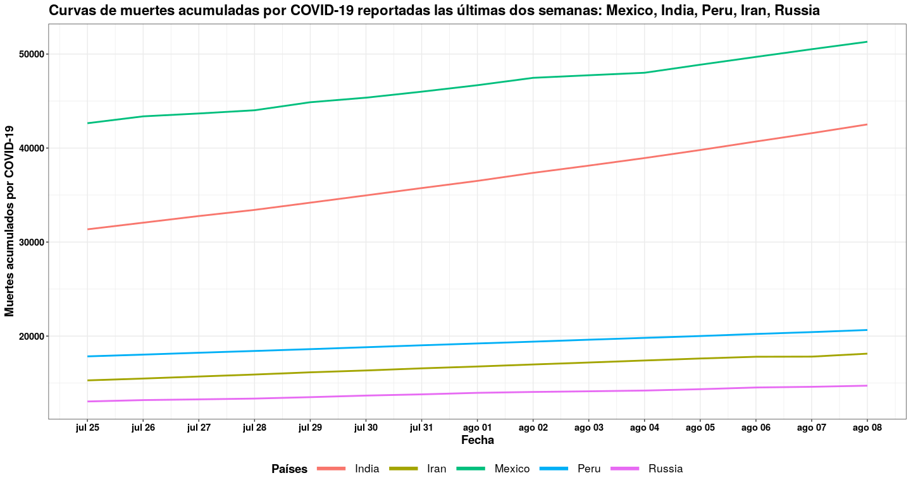<!-- -->
